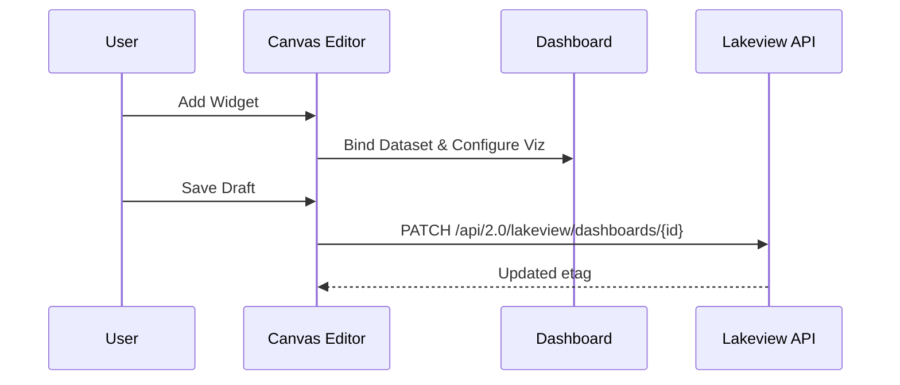
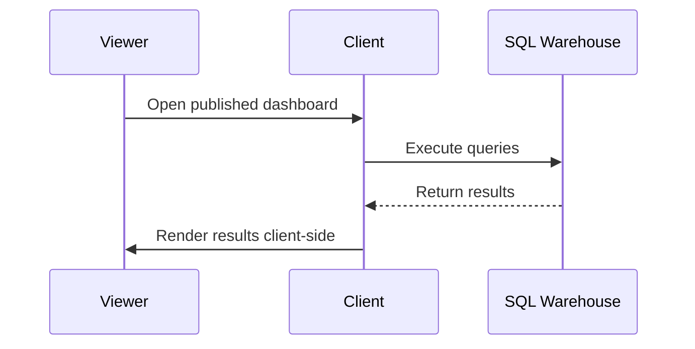
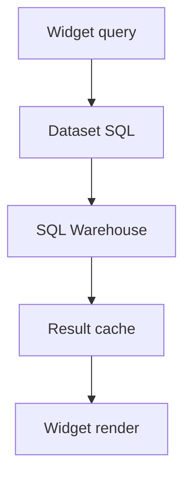
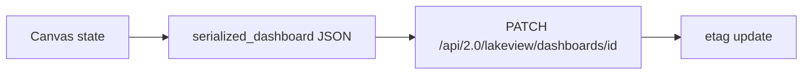
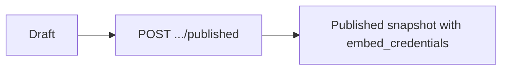
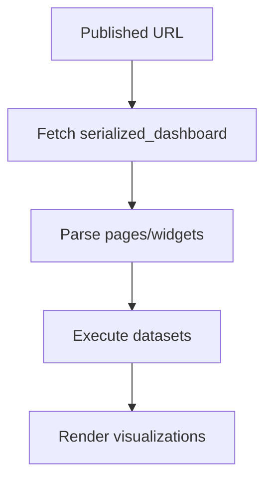
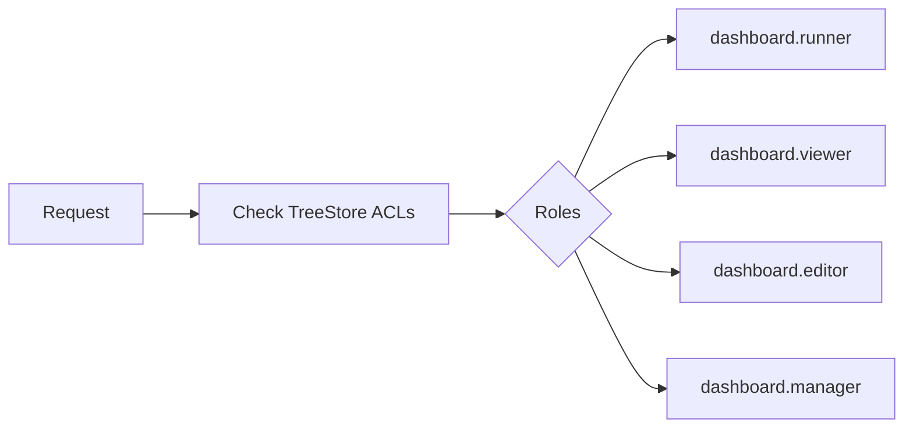

# Databricks Lakeview (AI/BI Dashboards) Architecture Document

## 1. Component Overview
- **Workspace**: The overarching container for all Lakeview Dashboards. [Observed]
- **Dashboard Object**: The primary entity representing an AI/BI dashboard, containing both draft and published states. [Verified]
- **Lakeview Runtime**: The client-side and server-side execution environment for dashboards. [Inferred]
- **SQL Warehouse**: The execution engine for dataset queries (Serverless or Classic). [Verified]
- **Unity Catalog**: The governance layer managing data access and lineage. [Observed]
- **Dataset**: A named entity within a dashboard containing a SQL query defining a data source. [Verified]
- **Query**: The actual SQL text executed against the warehouse. [Observed]
- **Widget**: A UI element placed on the canvas (e.g., a visualization or text box). [Verified]
- **Visualization**: The visual representation configuration (spec) for a widget. [Observed]
- **Canvas**: The authoring interface where pages and widgets are laid out. [Inferred]
- **Layout Engine**: The system that positions widgets on the 6-column grid. [Verified]
- **Runtime Renderer**: Client-side logic for rendering the dashboard for viewers. [Inferred]
- **Published Assets**: A snapshot of the dashboard marked for consumption by viewers. [Verified]
- **Permissions (TreeStore ACLs)**: Workspace-level access control mechanisms (viewer, editor, runner). [Observed]
- **Versioning (etag)**: Optimistic concurrency control using etags. [Verified]
- **Storage (.lvdash.json)**: The underlying storage format of the dashboard configuration in the workspace. [Observed]

## 2. Architecture Diagrams

### Authoring Flow

*[Verified] Based on API design and standard authoring behavior.*

### Runtime Flow

*[Observed] Based on the client-heavy rendering architecture.*

### SQL Execution Flow

*[Observed] Standard execution path for Databricks visualizations.*

### Save Flow

*[Verified] Based on Python/Go SDK method signatures for update.*

### Publish Flow

*[Verified] Reflected in the publish API endpoint.*

### Dashboard Rendering

*[Inferred] Common rendering pipeline for dashboard applications.*

### Permission Evaluation

*[Observed] Typical Workspace RBAC setup.*

## 3. Object Relationships
- **Dashboard contains Pages**: Dashboards have an array of page objects. [Verified]
- **Pages contain Layout items**: An array of layout configurations `{position, widget}`. [Observed]
- **Widgets reference Datasets**: Done via `queries[].query.datasetName`. [Verified]
- **Datasets contain SQL queries**: Defining the data fetch. [Verified]
- **Widgets have specs**: Configurations for `visualization` or `textbox_spec` (markdown). [Verified]
- **Filters**: Use `associative_filter_predicate_group` for cross-filtering. [Observed]
- **Position**: Uses a 6-column grid structure defined by `{x, y, width, height}`. [Verified]

## 4. Storage Architecture
- **Workspace object store (TreeStore)**: Underlying storage layer in the workspace. [Inferred]
- **.lvdash.json file format**: The file extension and format used for backing the dashboard. [Observed]
- **serialized_dashboard**: Treated as an opaque string in the API. [Verified]
- **etag**: Used for optimistic concurrency to prevent overwrite conflicts. [Verified]
- **lifecycle_state**: Can be `ACTIVE` or `TRASHED`. [Verified]

## 5. Data Flow
- **Dataset SQL → SQL Warehouse**: Data queries are executed via serverless or classic SQL warehouses. [Verified]
- **Client-side processing**: Small datasets are processed in the browser. [Observed]
- **Server-side aggregation**: Large datasets push aggregation to the warehouse. [Inferred]
- **Cross-filtering**: Achieved via the `associative_filter_predicate_group` virtual column. [Observed]

*Sources: Databricks official docs, Go SDK model.go, Python SDK dashboards.py, bundle-examples repo, Terraform provider source.*
