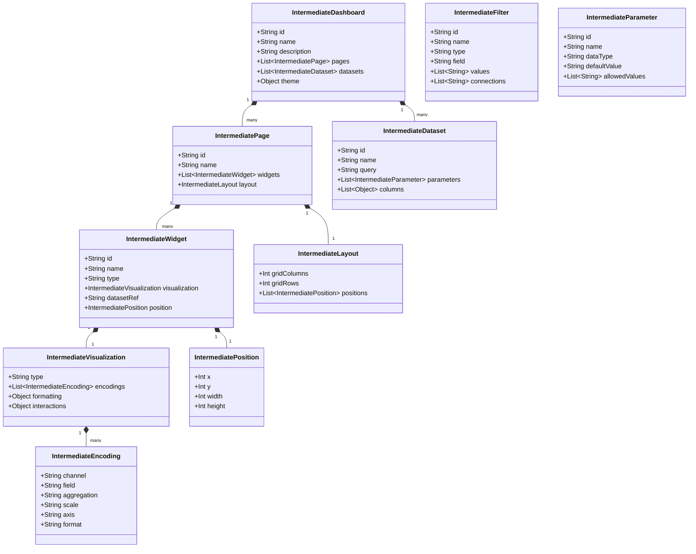
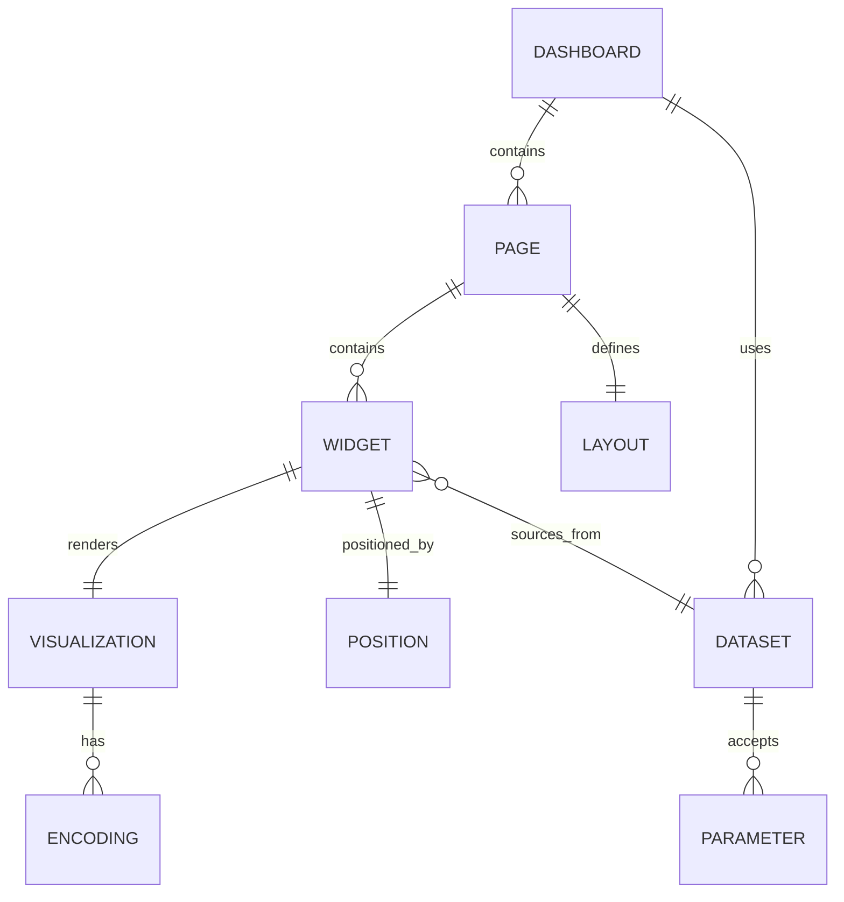

# Universal BI Object Model

This document outlines a vendor-neutral intermediate BI model designed to facilitate migrations from various platforms into Databricks Lakeview or other BI systems.

## Core Objects [Verified]



## Mapping Tables [Inferred]

### Tableau (.twb XML) -> Intermediate
- Workbooks become `IntermediateDashboard`.
- Dashboards become `IntermediatePage`.
- Sheets in a dashboard become `IntermediateWidget`.
- Data Sources become `IntermediateDataset`.

### Power BI (.pbit JSON) -> Intermediate
- Report sections become `IntermediatePage`.
- VisualContainers become `IntermediateWidget`.
- M/DAX queries translated (via intermediate logic) to SQL `IntermediateDataset`.

### Looker (LookML) -> Intermediate
- Dashboards map to `IntermediateDashboard`.
- Elements map to `IntermediateWidget`.
- Explores/Views mapped to `IntermediateDataset` (SQL).

### MicroStrategy (REST API) -> Intermediate
- Documents/Dossiers to `IntermediateDashboard`.
- Chapters to `IntermediatePage`.
- Visualizations to `IntermediateWidget`.

### Qlik (QVF/JSON) -> Intermediate
- Sheets to `IntermediatePage`.
- Objects to `IntermediateWidget`.
- Load script logic to `IntermediateDataset`.

### SAP BO (REST API) -> Intermediate
- WebI reports to `IntermediatePage`.
- Blocks to `IntermediateWidget`.
- Data Providers to `IntermediateDataset`.

### Intermediate -> Databricks Lakeview (.lvdash.json)
- `IntermediateDashboard` serialized to `lvdash.json`.
- `IntermediateDataset` becomes Lakeview `datasets`.
- `IntermediatePage` becomes Lakeview `pages`.
- `IntermediateWidget` becomes Lakeview `widgets`.

## JSON Schema [Observed]

```json
{
  "$schema": "http://json-schema.org/draft-07/schema#",
  "type": "object",
  "properties": {
    "id": { "type": "string" },
    "name": { "type": "string" },
    "pages": {
      "type": "array",
      "items": {
        "type": "object",
        "properties": {
          "id": { "type": "string" },
          "widgets": {
            "type": "array",
            "items": {
              "type": "object",
              "properties": {
                "id": { "type": "string" },
                "type": { "type": "string" },
                "datasetRef": { "type": "string" }
              }
            }
          }
        }
      }
    },
    "datasets": {
      "type": "array",
      "items": {
        "type": "object",
        "properties": {
          "id": { "type": "string" },
          "query": { "type": "string" }
        }
      }
    }
  }
}
```

## Entity Relationship Diagram [Verified]


