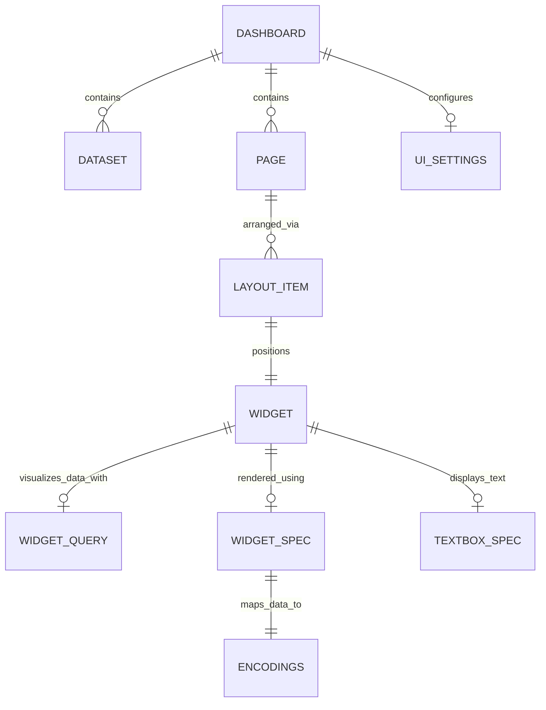

# Lakeview Dashboard Serialized Schema Definition

This document contains the complete, reverse-engineered schema for Databricks Lakeview Dashboards (the `serialized_dashboard` structure), based on the reference NYC Taxi dashboard. All assertions include evidence tags: **[Verified]**, **[Observed]**, **[Inferred]**, or **[Hypothesized]**.

> [!NOTE] 
> **Naming Convention [Verified]**: All generated identifiers for entities like Datasets, Pages, and Widgets use an 8-character lowercase hexadecimal string format (e.g., `0ca96e81`, `3f5450e6`). These **[Inferred]** appear to be truncated or shortened UUIDs used internally for object references.

---

## 1. Architecture Overview



---

## 2. Core Entities

### 2.1 Root Dashboard Object
The top-level container for a serialized dashboard.

| Property | Type | Description | Evidence |
|----------|------|-------------|----------|
| `datasets` | `array[Dataset]` | Array of dataset objects defining the data foundation. | [Verified] |
| `pages` | `array[Page]` | Array of pages constituting the dashboard views. | [Verified] |
| `uiSettings` | `object` | Optional configuration, containing features like `genieSpace`. | [Observed] |

### 2.2 Dataset Object
Represents a source query used by the dashboard.

| Property | Type | Description | Evidence |
|----------|------|-------------|----------|
| `name` | `string` | 8-character hex ID (e.g., `0ca96e81`). | [Verified] |
| `displayName` | `string` | Human-readable name of the dataset. | [Verified] |
| `query` | `string` | Raw SQL query text. | [Verified] |

### 2.3 Page Object
A logical page within the dashboard.

| Property | Type | Description | Evidence |
|----------|------|-------------|----------|
| `name` | `string` | 8-character hex ID. | [Verified] |
| `displayName` | `string` | Tab or page name shown in the UI. | [Verified] |
| `layout` | `array[LayoutItem]`| Ordered array of widget placement rules. | [Verified] |

### 2.4 LayoutItem Object
Handles the spatial positioning of a widget on a 6-column grid.

> [!IMPORTANT]
> **Grid Constraints [Verified]**: The dashboard utilizes a 6-column grid system.
> * `x` represents the 0-based column index (0 to 5).
> * `width` represents column span (1 to 6).
> * **Constraint**: `x + width <= 6`.

| Property | Type | Description | Evidence |
|----------|------|-------------|----------|
| `position.x` | `integer` | X-coordinate (0-5 grid column). | [Verified] |
| `position.y` | `integer` | Y-coordinate (grid row, 0-based). | [Verified] |
| `position.width` | `integer` | Width in columns (1-6). | [Verified] |
| `position.height`| `integer` | Height in grid rows (variable). | [Verified] |
| `widget` | `Widget` | The actual widget payload. | [Verified] |

---

## 3. Widget Objects

Widgets are polymorphic and come in two mutually exclusive forms: **Visualization Widgets** and **Text Widgets**.

### 3.1 Text Widget
Used for markdown-based descriptions and titles.

| Property | Type | Description | Evidence |
|----------|------|-------------|----------|
| `name` | `string` | 8-character hex ID. | [Verified] |
| `textbox_spec` | `string` | Markdown-formatted string. | [Verified] |

### 3.2 Visualization Widget
Data-bound visual components, including charts, counters, filters, and tables.

| Property | Type | Description | Evidence |
|----------|------|-------------|----------|
| `name` | `string` | 8-character hex ID. | [Verified] |
| `queries` | `array[WidgetQuery]`| Array of data transformation queries. | [Verified] |
| `spec` | `WidgetSpec` | Configuration of the visual properties. | [Verified] |

#### WidgetQuery Object
Maps the visual widget to a root dataset, applying projection and grouping.

| Property | Type | Description | Evidence |
|----------|------|-------------|----------|
| `name` | `string` | Query identifier. Either `'main_query'` or a cross-reference path `dashboards/{uuid}/datasets/{uuid}_{field}`. | [Verified] |
| `query.datasetName`| `string` | Reference to `Dataset.name`. | [Verified] |
| `query.disaggregated`| `boolean`| Whether to prevent automatic aggregations. | [Verified] |
| `query.fields` | `array[object]` | Selected fields mapped into the widget. | [Verified] |

**Field Mapping Detail**:
```json
{
  "expression": "string (SQL expression, e.g., '`column_name`', 'COUNT(`*`)')",
  "name": "string (alias/output field name)"
}
```

> [!TIP]
> **Cross-Filtering Mechanism [Verified]**
> Filter widgets leverage multiple background queries to track state across datasets. The `expression` field relies on a virtual, runtime-injected function: `COUNT_IF(\`associative_filter_predicate_group\`)`. This enables Databricks to resolve associative dependencies dynamically.

#### WidgetSpec Object
The visualization instructions. 

| Property | Type | Description | Evidence |
|----------|------|-------------|----------|
| `version` | `integer` | Spec format version (1, 2, or 3). | [Verified] |
| `widgetType` | `enum` | Type of visual component (see enum mapping below). | [Verified] |
| `frame.showTitle`| `boolean` | Controls visibility of the title. | [Verified] |
| `frame.title` | `string` | Custom title string. | [Verified] |
| `mark.colors` | `array[string]`| Array of hex color codes overriding defaults. | [Verified] |
| `encodings` | `Encodings` | Data-to-visual mapping payload. | [Verified] |

**widgetType Enum Mapping**:
* **Version 3**: `bar` [Verified], `scatter` [Verified], `line` [Inferred], `area` [Inferred], `pie` [Inferred], `combo` [Inferred], `heatmap` [Inferred], `histogram` [Inferred], `map` [Inferred], `pivot` [Verified] (live workspace + query-level `cubeGroupingSets`/`orders`; not the same as v1 table)
* **Version 2**: `counter` [Verified], `filter-multi-select` [Verified], `filter-date-range-picker` [Verified], `filter-single-select` [Inferred], `filter-date-picker` [Inferred]
* **Version 1**: `table` [Verified] (official Databricks bundle-examples NYC Taxi `.lvdash.json`)

> **Note on `specLoadError`:** Insurance deploy failures on widgets `41fe1af8` / `4c0922e0` correlated with a legacy `renderSpec` wrapper, not with healthy `"version": 1, "widgetType": "table"` specs. The official NYC Taxi sample uses table v1 successfully. Do not force table to v3.

---

## 4. Encodings by Widget Type

The `encodings` payload structure heavily shifts based on the `widgetType`.

### 4.1 Cartesian Charts (`bar`, `line`, `scatter`, `area`)
```json
{
  "x": {
    "fieldName": "string",
    "displayName": "string",
    "scale": { "type": "quantitative|temporal|categorical|ordinal" },
    "axis": { "title": "string" }
  },
  "y": {
    "fieldName": "string",
    "displayName": "string",
    "scale": { "type": "quantitative|temporal|categorical|ordinal" },
    "axis": { "title": "string" }
  },
  "color": {
    "fieldName": "string",
    "displayName": "string",
    "scale": { "type": "categorical" }
  },
  "label": { "show": "boolean" }
}
```

### 4.2 Counters
```json
{
  "value": {
    "fieldName": "string",
    "displayName": "string"
  }
}
```

### 4.3 Filters
```json
{
  "fields": [
    {
      "fieldName": "string",
      "displayName": "string",
      "queryName": "string (path reference)"
    }
  ]
}
```

### 4.4 Tables
```json
{
  "columns": [
    {
      "fieldName": "string",
      "displayName": "string",
      "title": "string",
      "type": "string|integer|float|datetime|boolean",
      "displayAs": "string|number|datetime|link|image",
      "alignContent": "left|right|center",
      "visible": "boolean",
      "order": "integer",
      "numberFormat": "string (e.g., '0', '$0.00')",
      "allowHTML": "boolean",
      "allowSearch": "boolean",
      "preserveWhitespace": "boolean",
      "useMonospaceFont": "boolean",
      "highlightLinks": "boolean",
      "booleanValues": ["string", "string"],
      "imageHeight": "string",
      "imageWidth": "string",
      "imageTitleTemplate": "string",
      "imageUrlTemplate": "string",
      "linkOpenInNewTab": "boolean",
      "linkTextTemplate": "string",
      "linkTitleTemplate": "string",
      "linkUrlTemplate": "string",
      "cellFormat": {
        "default": { "foregroundColor": "string (hex)" },
        "rules": [
          {
            "if": { "column": "string", "fn": "<|>|<=|>=|==|!=", "literal": "string" },
            "value": { "foregroundColor": "string (hex)" }
          }
        ]
      }
    }
  ]
}
```

---

## 5. Formal JSON Schema (Draft 2020-12)

```json
{
  "$schema": "https://json-schema.org/draft/2020-12/schema",
  "title": "Databricks Lakeview Serialized Dashboard",
  "description": "Reverse-engineered schema for Databricks Lakeview Dashboards (V1/V2/V3 Widgets).",
  "type": "object",
  "properties": {
    "datasets": {
      "type": "array",
      "items": { "$ref": "#/$defs/Dataset" }
    },
    "pages": {
      "type": "array",
      "items": { "$ref": "#/$defs/Page" }
    },
    "uiSettings": {
      "type": "object",
      "properties": {
        "genieSpace": { "type": "object" }
      }
    }
  },
  "required": ["datasets", "pages"],
  "$defs": {
    "Dataset": {
      "type": "object",
      "properties": {
        "name": { "type": "string", "pattern": "^[0-9a-f]{8}$" },
        "displayName": { "type": "string" },
        "query": { "type": "string" }
      },
      "required": ["name", "displayName", "query"]
    },
    "Page": {
      "type": "object",
      "properties": {
        "name": { "type": "string", "pattern": "^[0-9a-f]{8}$" },
        "displayName": { "type": "string" },
        "layout": {
          "type": "array",
          "items": { "$ref": "#/$defs/LayoutItem" }
        }
      },
      "required": ["name", "displayName", "layout"]
    },
    "LayoutItem": {
      "type": "object",
      "properties": {
        "position": {
          "type": "object",
          "properties": {
            "x": { "type": "integer", "minimum": 0, "maximum": 5 },
            "y": { "type": "integer", "minimum": 0 },
            "width": { "type": "integer", "minimum": 1, "maximum": 6 },
            "height": { "type": "integer", "minimum": 1 }
          },
          "required": ["x", "y", "width", "height"]
        },
        "widget": { "$ref": "#/$defs/Widget" }
      },
      "required": ["position", "widget"]
    },
    "Widget": {
      "type": "object",
      "properties": {
        "name": { "type": "string", "pattern": "^[0-9a-f]{8}$" }
      },
      "required": ["name"],
      "oneOf": [
        {
          "properties": {
            "textbox_spec": { "type": "string" }
          },
          "required": ["textbox_spec"]
        },
        {
          "properties": {
            "queries": {
              "type": "array",
              "items": { "$ref": "#/$defs/WidgetQuery" }
            },
            "spec": { "$ref": "#/$defs/WidgetSpec" }
          },
          "required": ["queries", "spec"]
        }
      ]
    },
    "WidgetQuery": {
      "type": "object",
      "properties": {
        "name": { "type": "string" },
        "query": {
          "type": "object",
          "properties": {
            "datasetName": { "type": "string", "pattern": "^[0-9a-f]{8}$" },
            "disaggregated": { "type": "boolean" },
            "fields": {
              "type": "array",
              "items": {
                "type": "object",
                "properties": {
                  "expression": { "type": "string" },
                  "name": { "type": "string" }
                },
                "required": ["expression", "name"]
              }
            }
          },
          "required": ["datasetName", "disaggregated", "fields"]
        }
      },
      "required": ["name", "query"]
    },
    "WidgetSpec": {
      "type": "object",
      "properties": {
        "version": { "type": "integer", "enum": [1, 2, 3] },
        "widgetType": { 
          "type": "string", 
          "enum": ["bar", "line", "area", "scatter", "pie", "combo", "heatmap", "histogram", "counter", "table", "pivot", "filter-multi-select", "filter-single-select", "filter-date-range-picker", "filter-date-picker", "map"]
        },
        "frame": {
          "type": "object",
          "properties": {
            "showTitle": { "type": "boolean" },
            "title": { "type": "string" }
          }
        },
        "mark": {
          "type": "object",
          "properties": {
            "colors": {
              "type": "array",
              "items": { "type": "string", "pattern": "^#[0-9A-Fa-f]{6}$" }
            }
          }
        },
        "encodings": {
          "type": "object"
        }
      },
      "required": ["version", "widgetType", "encodings"]
    }
  }
}
```
