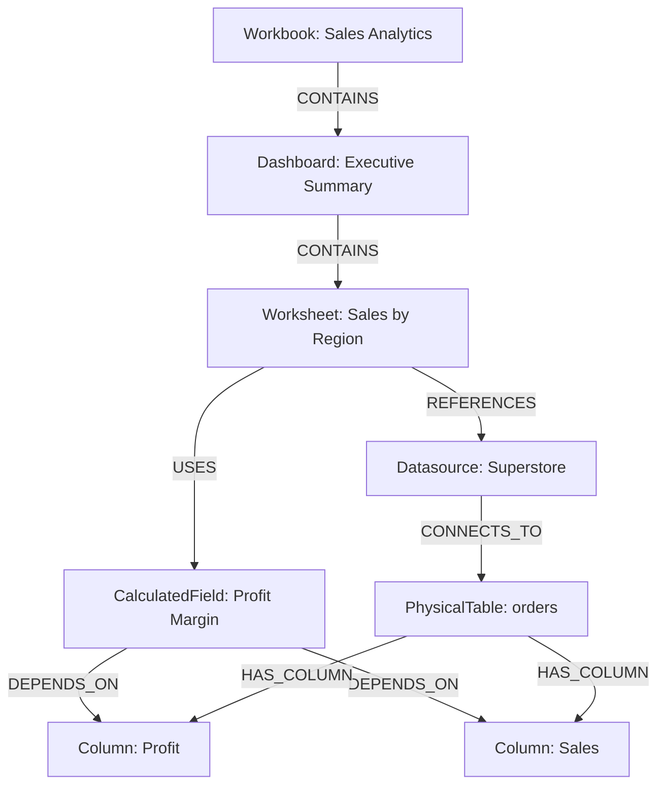

# Phase 2 — Tableau Dependency Graph Engine

This document provides an exhaustive, implementation-level technical plan for building a complete dependency graph system for Tableau workbook analysis. This engine forms the core of the migration platform, enabling automated dependency resolution, impact analysis, lineage tracing, and migration ordering.

---

## 1. Object Model

The dependency graph uses a Directed Acyclic Graph (DAG) for most lineage and execution paths, though specific structural relations may be bidirectional or cyclic (e.g., parameter feedbacks, though rare). We use `networkx` to represent this graph.

Each node in the graph represents a specific entity within a Tableau Workbook (TWB). Nodes possess a generic `node_type` and specific attributes based on their type.

### Node Definitions

| Node Type | Description | Key Attributes |
| :--- | :--- | :--- |
| **Workbook** (Root) | The container for all dashboard, sheet, and datasource elements. | `name`, `version`, `theme` |
| **Datasource** | A connection to a data system or an extract. | `name`, `caption`, `type`, `version` |
| **PhysicalTable** | A raw table/view from the database. | `name`, `connection`, `schema`, `db_table` |
| **LogicalTable** | A table defined in Tableau's logical layer. | `name`, `caption` |
| **Relationship** | The join or relationship definition between logical/physical tables. | `expression`, `type` (join/relate) |
| **Column** | A physical column from a database table. | `name`, `datatype`, `physical_table` |
| **CalculatedField** | A field derived via a Tableau formula. | `name`, `caption`, `datatype`, `formula` |
| **Parameter** | A user-defined parameter value. | `name`, `datatype`, `current_value`, `allowed_values` |
| **Set** | A named set of members. | `name`, `expression` |
| **Group** | A named grouping of members. | `name`, `field` |
| **Bin** | A binned continuous field. | `name`, `field`, `size` |
| **Filter** | A worksheet, datasource, or context filter. | `name`, `type`, `expression`, `is_context` |
| **Worksheet** | A single visualization (sheet). | `name` |
| **Dashboard** | A layout container of worksheets. | `name`, `size` |
| **DashboardAction** | Interactive actions (filter, highlight, url, goto). | `name`, `type`, `trigger`, `source`, `target` |
| **Story** | A collection of story points. | `name` |
| **StoryPoint** | An individual story frame. | `name`, `dashboard_ref` |

### JSON Schema for Nodes

```json
{
  "$schema": "http://json-schema.org/draft-07/schema#",
  "type": "object",
  "properties": {
    "id": { "type": "string" },
    "node_type": { 
      "type": "string",
      "enum": ["Workbook", "Datasource", "PhysicalTable", "LogicalTable", "Relationship", "Column", "CalculatedField", "Parameter", "Set", "Group", "Bin", "Filter", "Worksheet", "Dashboard", "DashboardAction", "Story", "StoryPoint"]
    },
    "name": { "type": "string" },
    "attributes": {
      "type": "object",
      "additionalProperties": true
    }
  },
  "required": ["id", "node_type", "name"]
}
```

---

## 2. Edge Types

Edges define the relationships between nodes. They are strictly directed.

| Edge Type | Source Node Type | Target Node Type | Description |
| :--- | :--- | :--- | :--- |
| **USES** | CalculatedField/Set/Group | Column/CalculatedField/Parameter | The source derives its value using the target. |
| **REFERENCES** | Worksheet | Datasource/CalculatedField/Column | A visualization uses specific fields or data. |
| **CONTAINS** | Dashboard/Workbook/Story | Worksheet/Dashboard/StoryPoint | Structural containment hierarchy. |
| **FILTERS** | Filter | Worksheet/Datasource | Applies restriction to the target. |
| **CONNECTS_TO** | Datasource | PhysicalTable/LogicalTable | Defines the base data schema. |
| **JOINS** | PhysicalTable | PhysicalTable | Database-level join configuration. |
| **RELATES_TO** | LogicalTable | LogicalTable | Tableau-level logical relationship. |
| **ACTS_ON** | DashboardAction | Worksheet/Dashboard | Source dashboard triggers an action on a target. |
| **DEPENDS_ON** | CalculatedField | Column/CalculatedField | Data lineage mapping from calculation to origin. |
| **PARAMETERIZES** | Parameter | Filter/CalculatedField | Parameter drives dynamic logic in the target. |

### Edge JSON Schema
```json
{
  "type": "object",
  "properties": {
    "source_id": { "type": "string" },
    "target_id": { "type": "string" },
    "edge_type": { 
      "type": "string",
      "enum": ["USES", "REFERENCES", "CONTAINS", "FILTERS", "CONNECTS_TO", "JOINS", "RELATES_TO", "ACTS_ON", "DEPENDS_ON", "PARAMETERIZES"]
    },
    "properties": { "type": "object" }
  },
  "required": ["source_id", "target_id", "edge_type"]
}
```

---

## 3. Graph Algorithms

Below is an exhaustive breakdown of analytical graph algorithms running on the TWB dependency graph.

### Topological Sort (Migration Ordering)
Identifies the correct creation order. Calculates topological sort using Kahn's algorithm or DFS.

```python
def get_migration_order(graph):
    try:
        return list(nx.topological_sort(graph))
    except nx.NetworkXUnfeasible:
        # Circular dependency detected
        cycles = list(nx.simple_cycles(graph))
        raise Exception(f"Circular dependency detected: {cycles}")
```

### Impact Analysis (Forward Propagation)
Given a changed source (e.g., a physical column), find all downstream nodes that require updates.

```python
def impact_analysis(graph, source_node_id):
    affected_nodes = list(nx.dfs_preorder_nodes(graph, source=source_node_id))
    return affected_nodes
```

### Lineage Tracing (Backward Propagation)
Given a dashboard or worksheet, find all base physical columns and parameters it depends on.

```python
def lineage_tracing(graph, target_node_id):
    reversed_graph = graph.reverse()
    sources = list(nx.dfs_preorder_nodes(reversed_graph, source=target_node_id))
    # Filter only base sources (indegree == 0 in original graph, outdegree == 0 in reversed)
    base_sources = [node for node in sources if reversed_graph.out_degree(node) == 0]
    return base_sources
```

### Orphan Detection
Identify nodes that are isolated or have no incoming paths from visual nodes (Worksheets/Dashboards).

```python
def detect_orphans(graph):
    # Roots: Nodes with 0 in-degree (usually Workbooks/Dashboards/Sheets)
    # Orphans: Fields/Datasources with 0 out-degree in the dependency perspective
    # Note: Edge direction matters. If A depends on B, edge is A -> B. 
    # If B is not referenced by any A, in-degree of B is 0.
    orphans = [node for node, in_degree in graph.in_degree() if in_degree == 0 and graph.nodes[node].get('node_type') not in ['Workbook', 'Dashboard', 'Worksheet', 'Story']]
    return orphans
```

---

## 4. Graph Construction from TWB

The Tableau Workbook (TWB) format is an XML file. Parsing it requires iterating through the XML tree to construct nodes and identify references.

### Pipeline
1. **XML Parsing**: Load `xml.etree.ElementTree`.
2. **Datasource Extraction**: Parse `<datasources>` to create `Datasource`, `PhysicalTable`, `LogicalTable`, and `Column` nodes.
3. **Calculated Field Extraction**: Parse `<column>` elements within datasources. Extract formulas.
4. **Formula Parsing**: Use regex or a grammar parser to extract field references like `[Category]` or `[Sales]` from formula strings. Create `USES` and `DEPENDS_ON` edges.
5. **Worksheet/Dashboard Parsing**: Parse `<worksheets>` and `<dashboards>`. Create `CONTAINS` and `REFERENCES` edges.

---

## 5. Visualization

The graph can be exported for visualization.

### Graphviz (DOT)
NetworkX supports native export to DOT format for Graphviz rendering.
```python
nx.nx_agraph.write_dot(graph, "tableau_dependencies.dot")
```

### Mermaid Diagram Example


---

## 6. Complete Python Implementation

Below is the complete implementation of the dependency graph engine.

```python
#!/usr/bin/env python3
"""
dependency_graph.py
Tableau Dependency Graph Engine using NetworkX.
"""

import networkx as nx
import xml.etree.ElementTree as ET
import json
import re
import argparse
from typing import List, Dict, Any, Set

class TableauDependencyGraph:
    def __init__(self):
        self.graph = nx.DiGraph()
        
    def add_node(self, node_id: str, node_type: str, name: str, **kwargs):
        self.graph.add_node(node_id, node_type=node_type, name=name, **kwargs)
        
    def add_edge(self, source_id: str, target_id: str, edge_type: str, **kwargs):
        self.graph.add_edge(source_id, target_id, edge_type=edge_type, **kwargs)

    def parse_twb(self, file_path: str):
        """Builds graph by parsing a TWB XML file."""
        tree = ET.parse(file_path)
        root = tree.getroot()
        
        # 1. Root Workbook
        wb_name = file_path.split("/")[-1].replace(".twb", "")
        self.add_node("wb_root", "Workbook", wb_name)
        
        # 2. Parse Datasources
        for ds in root.findall(".//datasource"):
            ds_name = ds.get('name', 'unknown')
            ds_caption = ds.get('caption', ds_name)
            self.add_node(f"ds_{ds_name}", "Datasource", ds_caption)
            self.add_edge("wb_root", f"ds_{ds_name}", "CONTAINS")
            
            # Extract connections and physical tables
            for conn in ds.findall(".//connection/relation"):
                table_name = conn.get('table', '')
                if table_name:
                    self.add_node(f"pt_{table_name}", "PhysicalTable", table_name)
                    self.add_edge(f"ds_{ds_name}", f"pt_{table_name}", "CONNECTS_TO")
            
            # Extract calculated fields and columns
            for col in ds.findall(".//column"):
                col_name = col.get('name', '')
                caption = col.get('caption', col_name)
                datatype = col.get('datatype', 'string')
                calc = col.find('calculation')
                
                if calc is not None:
                    # Calculated Field
                    formula = calc.get('formula', '')
                    self.add_node(f"cf_{col_name}", "CalculatedField", caption, formula=formula, datatype=datatype)
                    self.add_edge(f"ds_{ds_name}", f"cf_{col_name}", "CONTAINS")
                    
                    # Parse Formula Dependencies (Regex for [Field Name])
                    dependencies = re.findall(r'\[([^\]]+)\]', formula)
                    for dep in dependencies:
                        # Add generic dependency edge
                        self.add_edge(f"cf_{col_name}", f"field_{dep}", "DEPENDS_ON")
                else:
                    # Standard Column
                    self.add_node(f"field_{col_name}", "Column", caption, datatype=datatype)
                    self.add_edge(f"ds_{ds_name}", f"field_{col_name}", "CONTAINS")

        # 3. Parse Worksheets
        for ws in root.findall(".//worksheet"):
            ws_name = ws.get('name', 'unknown')
            self.add_node(f"ws_{ws_name}", "Worksheet", ws_name)
            self.add_edge("wb_root", f"ws_{ws_name}", "CONTAINS")
            
            # Extract references
            for dep in ws.findall(".//datasource-dependencies"):
                ds_ref = dep.get('datasource', '')
                self.add_edge(f"ws_{ws_name}", f"ds_{ds_ref}", "REFERENCES")
                for col in dep.findall(".//column"):
                    col_name = col.get('name', '')
                    self.add_edge(f"ws_{ws_name}", f"field_{col_name}", "REFERENCES")

        # 4. Parse Dashboards
        for db in root.findall(".//dashboard"):
            db_name = db.get('name', 'unknown')
            self.add_node(f"db_{db_name}", "Dashboard", db_name)
            self.add_edge("wb_root", f"db_{db_name}", "CONTAINS")
            
            for zone in db.findall(".//zone[@type='worksheet']"):
                ws_ref = zone.get('name', '')
                self.add_edge(f"db_{db_name}", f"ws_{ws_ref}", "CONTAINS")

    def get_migration_order(self) -> List[str]:
        """Returns topological sort of nodes."""
        try:
            return list(nx.topological_sort(self.graph))
        except nx.NetworkXUnfeasible:
            cycles = list(nx.simple_cycles(self.graph))
            raise Exception(f"Circular dependency detected: {cycles}")

    def impact_analysis(self, source_node: str) -> List[str]:
        """Forward propagate from a node."""
        if source_node not in self.graph:
            return []
        return list(nx.dfs_preorder_nodes(self.graph, source=source_node))

    def lineage_tracing(self, target_node: str) -> List[str]:
        """Backward propagate from a node."""
        if target_node not in self.graph:
            return []
        reversed_graph = self.graph.reverse()
        return list(nx.dfs_preorder_nodes(reversed_graph, source=target_node))

    def detect_orphans(self) -> List[str]:
        """Detect unused nodes (in-degree 0) excluding roots."""
        allowed_roots = {'Workbook', 'Dashboard', 'Worksheet', 'Story'}
        return [
            node for node, in_degree in self.graph.in_degree() 
            if in_degree == 0 and self.graph.nodes[node].get('node_type') not in allowed_roots
        ]

    def export_json(self) -> Dict[str, Any]:
        """Export graph to JSON."""
        return nx.node_link_data(self.graph)

    def export_mermaid(self) -> str:
        """Export graph to Mermaid flowchart."""
        lines = ["graph TD"]
        for u, v, data in self.graph.edges(data=True):
            u_name = self.graph.nodes[u].get('name', u).replace('"', '')
            v_name = self.graph.nodes[v].get('name', v).replace('"', '')
            edge_type = data.get('edge_type', 'RELATES_TO')
            lines.append(f'    "{u}"["{u_name}"] --> |{edge_type}| "{v}"["{v_name}"]')
        return "\n".join(lines)


if __name__ == "__main__":
    parser = argparse.ArgumentParser(description="Tableau Dependency Graph Engine")
    parser.add_argument('--twb', required=True, help="Path to TWB file")
    parser.add_argument('--export-json', help="Path to output JSON graph")
    parser.add_argument('--export-mermaid', help="Path to output Mermaid diagram")
    parser.add_argument('--impact', help="Node ID to run impact analysis")
    
    args = parser.parse_args()
    
    engine = TableauDependencyGraph()
    try:
        engine.parse_twb(args.twb)
        print(f"Graph constructed with {engine.graph.number_of_nodes()} nodes and {engine.graph.number_of_edges()} edges.")
        
        if args.export_json:
            with open(args.export_json, 'w') as f:
                json.dump(engine.export_json(), f, indent=2)
            print(f"JSON graph exported to {args.export_json}")
            
        if args.export_mermaid:
            with open(args.export_mermaid, 'w') as f:
                f.write(engine.export_mermaid())
            print(f"Mermaid diagram exported to {args.export_mermaid}")
            
        if args.impact:
            impact_nodes = engine.impact_analysis(args.impact)
            print(f"Impact Analysis for {args.impact}: {impact_nodes}")
            
    except Exception as e:
        print(f"Error: {str(e)}")

```
