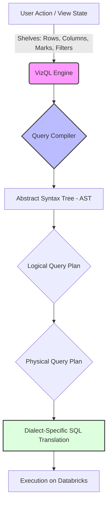

# Phase 3 — Tableau SQL Compiler: Implementation-Level Translation Guide

## 1. How Tableau Generates SQL (VizQL to SQL)

Tableau's core engine, VizQL (Visual Query Language), translates visual actions (dragging and dropping fields onto shelves) into optimized SQL queries directed at the underlying database. Understanding this translation is critical for building a Tableau-to-Databricks compiler.

### VizQL Internal Query Generation Pipeline

The VizQL pipeline follows a multi-stage compilation process:



1. **User Action / View State**: The configuration of the visualization (Rows, Columns, Marks, Filters, Pages).
2. **Abstract Syntax Tree (AST)**: VizQL builds an internal representation of the required data.
3. **Logical Query Plan**: Determines the fundamental operations needed (Projections, Selections, Joins, Aggregations).
4. **Physical Query Plan**: Optimizes the plan (e.g., join culling).
5. **Dialect-Specific Translation**: Converts the physical plan into the specific SQL dialect of the target database (Databricks SQL in our case).

### Shelf Translation to SQL

| Tableau Shelf | SQL Equivalent | Description |
| :--- | :--- | :--- |
| **Rows / Columns** | `GROUP BY` / `SELECT` | Dimensions placed here form the primary `GROUP BY` clause. Measures placed here dictate the aggregate functions in the `SELECT` clause. |
| **Marks: Detail** | `GROUP BY` | Adds granularity to the view without changing the layout. Translates to an additional column in the `GROUP BY` clause. |
| **Marks: Color/Size/Shape** | `GROUP BY` / `SELECT` | If a dimension, adds to `GROUP BY`. If a measure, adds an aggregate to the `SELECT`. |
| **Filters** | `WHERE` / `HAVING` | Dimension filters translate to `WHERE`. Measure filters (aggregations) translate to `HAVING`. |
| **Pages** | Parameterized `WHERE` | Acts as a dynamic filter, iterating through values. In SQL, this often looks like `WHERE PageField = ?` in parameterized queries. |

**Example Translation:**
- Columns: `Region` (Dimension)
- Rows: `SUM(Sales)` (Measure)
- Color: `Category` (Dimension)
- Filter: `YEAR(Order Date) = 2023`

```sql
-- Generated Databricks SQL
SELECT 
    Region, 
    Category, 
    SUM(Sales) AS sum_sales
FROM superstore
WHERE YEAR(Order_Date) = 2023
GROUP BY 
    Region, 
    Category
```

---

## 2. JOIN Compilation

Tableau handles multiple tables through Joins and Relationships (introduced in 2020.2). The compiler must accurately translate these data model definitions.

### Join Types and SQL Equivalents

| Tableau Join | SQL Equivalent |
| :--- | :--- |
| Inner | `INNER JOIN` |
| Left | `LEFT OUTER JOIN` |
| Right | `RIGHT OUTER JOIN` |
| Full Outer | `FULL OUTER JOIN` |
| Cross | `CROSS JOIN` (Often implemented as `INNER JOIN ON 1=1` historically, but Databricks supports `CROSS JOIN`) |

### Join Culling
Tableau optimizes queries by omitting joins that are not required for the current view, provided referential integrity (primary/foreign keys) is defined. 
*Compiler implementation:* If a table's fields are not in the `SELECT`, `WHERE`, `GROUP BY`, or `HAVING` clauses, and it's a `LEFT JOIN` or an `INNER JOIN` with enforced referential integrity, it can be pruned.

### Relationships vs. Joins

- **Joins (Physical Layer):** Combine tables into a single wide table before analysis. Generates a single SQL query with multiple `JOIN` clauses.
- **Relationships (Logical Layer):** Keeps tables separate. Generates multiple separate SQL queries and stitches the results locally, OR generates a complex SQL query utilizing `COALESCE` and full outer joins depending on the structure.

**Relationship SQL Generation (Contextual Joins):**
When querying a measure from Table B grouped by a dimension from Table A, Tableau generates:
```sql
SELECT A.Dim1, SUM(B.Measure1)
FROM TableA A
INNER JOIN TableB B ON A.Key = B.Key
GROUP BY A.Dim1
```
If unmatched records must be preserved (e.g., showing Dimensions with no Facts), it may use a `LEFT JOIN` or generate separate queries and stitch them in VizQL memory. For a Databricks migration, pushdown is preferred.

---

## 3. Filter Compilation

Filters are applied at different stages in the Tableau order of operations. The compiler must translate them into the correct SQL clauses or nested subqueries.

| Filter Type | Tableau Operation | Databricks SQL Translation |
| :--- | :--- | :--- |
| **Extract Filters** | Limits data extracted. | `WHERE` clause in the ELT pipeline generating the Delta table. |
| **Data Source Filters** | Applies to all queries. | `WHERE` clause applied to a foundational CTE or View. |
| **Context Filters** | Applied before dimension filters. | Generates a Temp Table or a foundational CTE (e.g., `WITH context AS (SELECT * FROM t WHERE ContextFilter)`). |
| **Dimension Filters** | Standard row-level filters. | `WHERE` clause in the main query. |
| **Measure Filters** | Aggregated data filters. | `HAVING` clause. |

### Specific Filter Implementations

- **Top N Filters:** Translates to a subquery using window functions.
  *Tableau:* Top 10 Customers by SUM(Sales)
  ```sql
  -- Databricks SQL
  WITH RankedCustomers AS (
      SELECT Customer_Name, SUM(Sales) as total_sales,
             RANK() OVER(ORDER BY SUM(Sales) DESC) as rnk
      FROM superstore
      GROUP BY Customer_Name
  )
  SELECT * FROM RankedCustomers WHERE rnk <= 10;
  ```

- **Set Filters:** Translates to `IN` or `NOT IN`.
  ```sql
  WHERE Customer_ID IN ('C1', 'C2', 'C3')
  ```

- **Wildcard / Condition Filters:**
  ```sql
  -- Wildcard
  WHERE Customer_Name LIKE '%Smith%'
  
  -- Condition (e.g., SUM(Sales) > 1000)
  HAVING SUM(Sales) > 1000
  ```

---

## 4. LOD Expression Compilation

Level of Detail (LOD) expressions allow aggregations at a granularity different from the view level. They require complex SQL translations, usually involving correlated subqueries or Common Table Expressions (CTEs) combined with joins.

### FIXED LOD
Computes a value using the specified dimensions, entirely independent of the view dimensions.

*Tableau:* `{FIXED [Region] : SUM([Sales])}`
*SQL Pattern:* An independent subquery joined back to the main query or calculated using Window functions if applicable.

```sql
-- Databricks Translation (Subquery Join Pattern)
WITH fixed_region_sales AS (
    SELECT Region, SUM(Sales) AS region_sales
    FROM superstore
    GROUP BY Region
)
SELECT main.*, f.region_sales
FROM superstore main
LEFT JOIN fixed_region_sales f ON main.Region = f.Region;

-- Databricks Translation (Window Function Pattern - More performant for inline calculations)
SELECT *, SUM(Sales) OVER(PARTITION BY Region) AS region_sales
FROM superstore;
```

### INCLUDE LOD
Computes a value using the specified dimensions *in addition to* whatever dimensions are in the view.

*Tableau:* `{INCLUDE [State] : AVG([Profit])}`
*Scenario:* View is at `Region` level. The LOD calculates average profit per state, then averages those state averages at the Region level.

```sql
-- Databricks Translation
WITH state_profit AS (
    -- Include State granularity along with view granularity (Region)
    SELECT Region, State, AVG(Profit) AS avg_state_profit
    FROM superstore
    GROUP BY Region, State
)
-- Re-aggregate at the view level
SELECT Region, AVG(avg_state_profit) AS avg_profit_per_state
FROM state_profit
GROUP BY Region;
```

### EXCLUDE LOD
Computes a value omitting specified dimensions that are present in the view.

*Tableau:* `{EXCLUDE [Quarter] : SUM([Sales])}`
*Scenario:* View is at `Year`, `Quarter`, `Month`. Exclude removes Quarter from the calculation granularity.

```sql
-- Databricks Translation
-- Instead of grouping by Year, Quarter, Month, group by Year, Month
WITH exclude_quarter_sales AS (
    SELECT Year, Month, SUM(Sales) AS yearly_monthly_sales
    FROM superstore
    GROUP BY Year, Month
)
SELECT v.Year, v.Quarter, v.Month, e.yearly_monthly_sales
FROM view_base v
LEFT JOIN exclude_quarter_sales e ON v.Year = e.Year AND v.Month = e.Month;
```

### Context vs. Dimension Filters with LODs
- Context filters evaluate *before* FIXED LODs. Translate by applying the context filter in the FIXED LOD subquery.
- Dimension filters evaluate *after* FIXED LODs. Do *not* apply the dimension filter to the FIXED LOD subquery.

---

## 5. Table Calculation Compilation

Tableau performs table calculations in memory *after* the initial SQL query returns. To replicate this entirely in Databricks SQL, we must extensively utilize Window Functions.

### Addressing and Partitioning
- **Compute Using (Addressing):** Defines the direction of the calculation. Maps to the `ORDER BY` clause in a window function.
- **Partitioning:** Defines when the calculation restarts. Maps to the `PARTITION BY` clause.

### Translations Matrix

| Tableau Function | Databricks Window Function Translation | Notes |
| :--- | :--- | :--- |
| `RUNNING_SUM(expr)` | `SUM(expr) OVER (PARTITION BY [partition_fields] ORDER BY [addressing_fields] ROWS UNBOUNDED PRECEDING)` | |
| `RUNNING_AVG(expr)` | `AVG(expr) OVER (PARTITION BY ... ORDER BY ... ROWS UNBOUNDED PRECEDING)` | |
| `WINDOW_SUM(expr, -N, +M)`| `SUM(expr) OVER (PARTITION BY ... ORDER BY ... ROWS BETWEEN N PRECEDING AND M FOLLOWING)` | Support for dynamic offsets requires complex case logic. |
| `INDEX()` | `ROW_NUMBER() OVER (PARTITION BY ... ORDER BY ...)` | |
| `FIRST()` | `-(ROW_NUMBER() OVER (PARTITION BY ... ORDER BY ...) - 1)` | Returns offset to first row (e.g., 0, -1, -2). |
| `LAST()` | `COUNT(*) OVER (PARTITION BY ...) - ROW_NUMBER() OVER (PARTITION BY ... ORDER BY ...)` | Returns offset to last row. |
| `RANK(expr)` | `RANK() OVER (PARTITION BY ... ORDER BY expr DESC)` | |
| `RANK_UNIQUE(expr)`| `ROW_NUMBER() OVER (PARTITION BY ... ORDER BY expr DESC)` | |
| `LOOKUP(expr, offset)` | `LAG(expr, ABS(offset)) OVER(...)` (if offset < 0) <br> `LEAD(expr, offset) OVER(...)` (if offset > 0) | |
| `SIZE()` | `COUNT(*) OVER (PARTITION BY ...)` | |
| `TOTAL(expr)` | `SUM(expr) OVER (PARTITION BY ...)` | Ignored ordering. |
| `PREVIOUS_VALUE()` | **Complex/Recursive.** Often requires multiple CTEs or `LAG()` with `COALESCE` for simple cases, but true recursion is difficult in standard SQL without recursive CTEs. | |

---

## 6. Aggregation Rules

Tableau automatically wraps measures in aggregation functions.

| Tableau Aggregation | Databricks SQL |
| :--- | :--- |
| `SUM([Field])` | `SUM(Field)` |
| `AVG([Field])` | `AVG(Field)` |
| `MIN([Field])` | `MIN(Field)` |
| `MAX([Field])` | `MAX(Field)` |
| `COUNT([Field])` | `COUNT(Field)` (Ignores NULLs) |
| `COUNTD([Field])`| `COUNT(DISTINCT Field)` / `APPROX_COUNT_DISTINCT(Field)` (for performance) |
| `MEDIAN([Field])`| `PERCENTILE_CONT(0.5) WITHIN GROUP (ORDER BY Field)` or `PERCENTILE(Field, 0.5)` |
| `ATTR([Field])` | `CASE WHEN MIN(Field) = MAX(Field) THEN MIN(Field) ELSE NULL END` |

*Note on ATTR():* Tableau displays `*` when there are multiple values. In SQL, returning a specific string `*` mixed with numeric types causes type cast errors. Returning `NULL` is the safest type-consistent approach, handled by presentation layer logic.

---

## 7. Date Functions

Date handling is a major source of dialect differences. Databricks uses standard Spark SQL date functions.

| Tableau Date Function | Databricks SQL Translation |
| :--- | :--- |
| `DATEPART('year', [Date])` | `EXTRACT(YEAR FROM Date)` or `YEAR(Date)` |
| `DATEPART('month', [Date])` | `EXTRACT(MONTH FROM Date)` or `MONTH(Date)` |
| `DATEPART('weekday', [Date])`| `DAYOFWEEK(Date)` (Note: Databricks 1=Sun. Adjust if Tableau start-of-week differs). |
| `DATETRUNC('month', [Date])`| `DATE_TRUNC('month', Date)` |
| `DATEDIFF('day', [D1], [D2])`| `DATEDIFF(D2, D1)` (Note argument order difference). |
| `DATEDIFF('month', [D1], [D2])`| `MONTHS_BETWEEN(D2, D1)` (May need rounding/casting). |
| `DATEADD('day', 5, [Date])` | `DATE_ADD(Date, 5)` |
| `DATEADD('month', 2, [Date])`| `ADD_MONTHS(Date, 2)` |
| `DATENAME('month', [Date])` | `DATE_FORMAT(Date, 'MMMM')` |

---

## 8. SQL Dialect Differences (Tableau Calculated Fields to Databricks SQL)

| Tableau Syntax / Function | Databricks SQL Equivalent | Notes |
| :--- | :--- | :--- |
| String Concatenation: `[A] + [B]` | `CONCAT(A, B)` or `A || B` | Databricks supports `\|\|` operator. |
| `IFNULL([A], [B])` | `COALESCE(A, B)` or `IFNULL(A, B)` | `COALESCE` is ANSI standard. |
| `ISNULL([A])` | `A IS NULL` | |
| `IIF(cond, true_val, false_val)`| `IFF(cond, true_val, false_val)` or `CASE WHEN...` | |
| `IF cond THEN x ELSEIF cond2 THEN y ELSE z END` | `CASE WHEN cond THEN x WHEN cond2 THEN y ELSE z END` | Exact translation pattern. |
| Type Casting: `INT([A])`, `FLOAT([A])` | `CAST(A AS INT)`, `CAST(A AS DOUBLE)` | |
| `STR([A])` | `CAST(A AS STRING)` | |
| Boolean Logic: `AND`, `OR`, `NOT` | `AND`, `OR`, `NOT` | Direct mapping. |
| String functions: `LEFT`, `RIGHT`, `MID`| `LEFT`, `RIGHT`, `SUBSTRING` | |
| `FIND(string, substring, [start])` | `LOCATE(substring, string, [start])` | Note argument order reversal. |

---

## 9. Query Optimization for Databricks

When translating VizQL to Databricks SQL, generating *correct* SQL is not enough; it must be *optimized* for Delta Lake and the Spark engine.

### Predicate Pushdown Opportunities
Ensure that filter conditions (`WHERE` clauses) are applied as early as possible in subqueries or CTEs. Databricks Catalyst optimizer does this well, but explicit pushdown in the generated SQL guarantees it.

### Partition Pruning & Z-Ordering
- **Partition Pruning:** If a Delta table is partitioned by `Year` and `Month`, translations of Tableau Date filters MUST utilize these partition columns directly.
  *Bad:* `WHERE YEAR(OrderDate) = 2023` (Causes full scan to calculate YEAR).
  *Good:* `WHERE OrderDate >= '2023-01-01' AND OrderDate < '2024-01-01'` (Allows pruning if OrderDate is partitioned or Z-ordered).
- **Z-Ordering:** Use Z-order columns in high-cardinality dimension filters.

### Materialized View Candidates
Identify heavy LOD expressions or complex Table Calculations used in frequently accessed dashboards. Compile these into Databricks Materialized Views (or Delta Live Tables) that are pre-aggregated.

### Caching Strategies
For dashboards with static historical data, utilize Databricks SQL Query Result Caching. Ensure the generated SQL is deterministic and parameter-consistent to hit the cache.

---

## 10. SQL Rewrite Rules (Transformation Engine)

The compiler must implement formal rewrite rules applied to the Abstract Syntax Tree (AST).

**Rule 1: Tableau Date Filter to Range Pushdown**
- **Input Pattern:** `YEAR(col) = [param_year]`
- **Output Pattern:** `col >= CAST(CONCAT([param_year], '-01-01') AS DATE) AND col < CAST(CONCAT([param_year] + 1, '-01-01') AS DATE)`
- **Conditions:** Applied to timestamp/date columns.
- **Priority:** High (Enables Delta partition pruning).

**Rule 2: DATEDIFF argument swap**
- **Input Pattern:** `DATEDIFF('day', StartDate, EndDate)`
- **Output Pattern:** `DATEDIFF(EndDate, StartDate)`
- **Conditions:** Match specific `DATEDIFF` signature.
- **Priority:** Critical (Correctness).

**Rule 3: ATTR to CASE WHEN**
- **Input Pattern:** `ATTR(col)`
- **Output Pattern:** `CASE WHEN MIN(col) = MAX(col) THEN MIN(col) ELSE NULL END`
- **Conditions:** Applied when processing aggregate functions.
- **Priority:** Medium.

**Rule 4: LOD FIXED to Window Function (where applicable)**
- **Input Pattern:** `{FIXED [Dim] : SUM([Measure])}` used in an inline calculation.
- **Output Pattern:** `SUM(Measure) OVER (PARTITION BY Dim)`
- **Conditions:** Can be applied if the view granularity is finer than or equal to the FIXED dimension, and no complex context filters interfere.
- **Priority:** High (Avoids expensive joins).

**Rule 5: FIND to LOCATE**
- **Input Pattern:** `FIND(str, substr)`
- **Output Pattern:** `LOCATE(substr, str)`
- **Conditions:** String function mapping.
- **Priority:** Critical (Correctness).
