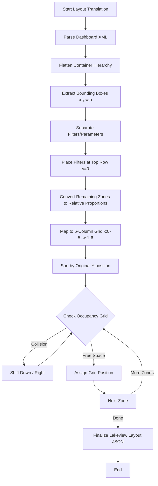

# Phase 9: Layout Translation Engine

This document outlines the algorithm and data structures required to translate Tableau dashboard layouts into Databricks Lakeview layouts.

## 1. Layout Models

### Tableau Layout Model
- **Hierarchy:** Tree-based. Consists of horizontal and vertical containers.
- **Positioning:** Floating objects use absolute coordinates (x, y, w, h). Tiled objects use flexible sizing based on constraints and container flow.
- **Padding:** Outer and inner padding are explicitly set.
- **Devices:** Specific overrides for Phone, Tablet, Desktop.

### Lakeview Layout Model
- **Grid:** 6-column discrete grid system.
- **Rows:** Infinite vertical scroll, discrete row assignments.
- **Constraints:** Widgets have an integer width (1 to 6).
- **Positioning:** `{x: 0..5, y: integer, width: 1..6, height: integer}`.
- **Responsiveness:** Managed automatically by the grid; no explicit device layouts or floating.

## 2. Translation Algorithm

The translation occurs in several steps to convert continuous/hierarchical coordinates to a discrete 6-column grid.

### Step 1: Flatten Container Tree
Walk the Tableau XML `<zonestyle>` and `<zone>` elements. Compute absolute bounding boxes `(x, y, width, height)` for every tiled zone by traversing down the tree and accumulating dimensions.

### Step 2: Calculate Relative Positions
Using the overall dashboard dimensions `(D_width, D_height)`:
- `rel_x = x / D_width`
- `rel_w = width / D_width`
- `rel_y = y / D_height`
- `rel_h = height / D_height`

### Step 3: Map to 6-Column Grid
Convert relative dimensions to 6-column grid units:
- `grid_w = max(1, round(rel_w * 6))`
- `grid_x = round(rel_x * 6)`
Ensure `grid_x + grid_w <= 6`. If it exceeds 6, truncate `grid_w` or shift `grid_x`.

Calculate Rows:
- Sort all flattened zones by their `y` coordinate (top-to-bottom).
- Group items that have overlapping vertical bounds into the same logical "row".
- Assign `grid_y` sequentially to these rows. Height `grid_h` is assigned a nominal value (e.g., 2) or scaled based on relative height.

### Step 4: Collision Detection
Iterate through the allocated widgets. Maintain a 2D occupancy grid.
If a widget overlaps an occupied cell:
- Shift it horizontally if space exists (`grid_x += 1`).
- Otherwise, shift it vertically to the next row (`grid_y += 1`).

### Step 5: Zone Type Mapping
- **Worksheet:** Map to Lakeview Chart widget.
- **Filter/Parameter:** Extract, map to Filter widgets, and pin to `grid_y = 0` (top row).
- **Text:** Map to Lakeview Textbox (`textbox_spec`).
- **Image:** Map to Textbox with Markdown image or Image widget.

### Step 6: Floating Object Handling
Extract floating objects. Since Lakeview does not support floating, insert them into the grid. Calculate their centroid `(x + w/2, y + h/2)`, find the nearest empty grid cell, and place them there (best-effort).

---

## 3. Pseudocode

```python
def translate_layout(dashboard_xml, dashboard_width, dashboard_height):
    zones = flatten_tree(dashboard_xml.root_zone, x=0, y=0, w=dashboard_width, h=dashboard_height)
    floating_zones = extract_floating(dashboard_xml)
    all_zones = zones + floating_zones
    
    # Sort top to bottom, then left to right
    all_zones.sort(key=lambda z: (z.y, z.x))
    
    grid = OccupancyGrid(cols=6)
    lakeview_widgets = []
    
    # Extract filters first and put them at the top
    filters = [z for z in all_zones if z.type == 'filter']
    other_zones = [z for z in all_zones if z.type != 'filter']
    
    current_y = 0
    current_x = 0
    
    # Place filters
    for f in filters:
        grid_w = max(1, round((f.width / dashboard_width) * 6))
        if current_x + grid_w > 6:
            current_x = 0
            current_y += 1
            
        lakeview_widgets.append({
            "type": "filter",
            "layout": {"x": current_x, "y": current_y, "width": grid_w, "height": 1}
        })
        grid.mark_occupied(current_x, current_y, grid_w, 1)
        current_x += grid_w
        
    # Place other zones
    current_y += 1 # move to next row for main content
    
    for z in other_zones:
        # Calculate ideal grid dimensions
        rel_x = z.x / dashboard_width
        rel_w = z.width / dashboard_width
        
        ideal_x = round(rel_x * 6)
        ideal_w = max(1, round(rel_w * 6))
        
        # Ensure it fits in 6 columns
        if ideal_x + ideal_w > 6:
            if ideal_w > 6: ideal_w = 6
            ideal_x = 6 - ideal_w
            
        # Find next available Y for this X
        ideal_y = grid.find_next_free_y(ideal_x, ideal_w, start_y=current_y)
        
        lakeview_widgets.append({
            "id": z.id,
            "type": map_zone_type(z.type),
            "layout": {"x": ideal_x, "y": ideal_y, "width": ideal_w, "height": 2}
        })
        grid.mark_occupied(ideal_x, ideal_y, ideal_w, 2)

    return lakeview_widgets
```

## 4. Mermaid Flowchart



## 5. Edge Cases

- **Nested Containers (3+ levels deep):** Handled gracefully by the flattening step, which computes absolute bounding boxes regardless of depth.
- **Overlapping Floating Objects:** The collision detection shifts overlapping floating objects into distinct grid cells. Visual overlap is lost.
- **Dashboard with only floating layout:** The sorting (by Y, then X) will linearize the floating objects into a structured grid.
- **Very small widgets (< 1 column width):** Forced to a minimum width of 1 column, potentially pushing adjacent widgets to the next row.
- **Very tall dashboards (100+ rows):** Lakeview supports infinite scrolling, so infinite Y allocation is acceptable.
- **Device-specific layouts:** Default desktop layout is translated. Phone/Tablet layouts are ignored as Lakeview is intrinsically responsive.
