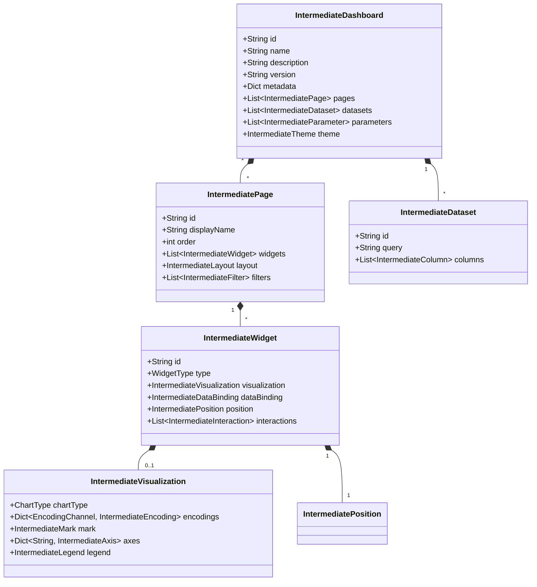
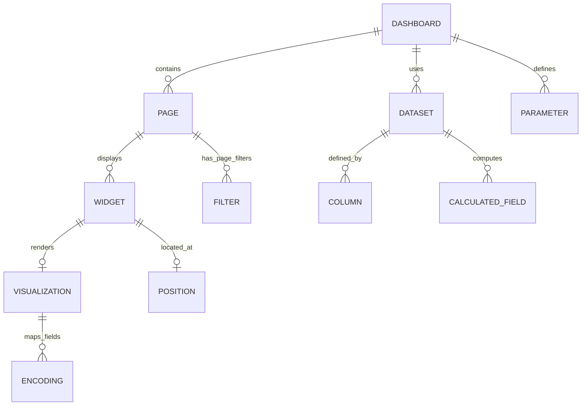
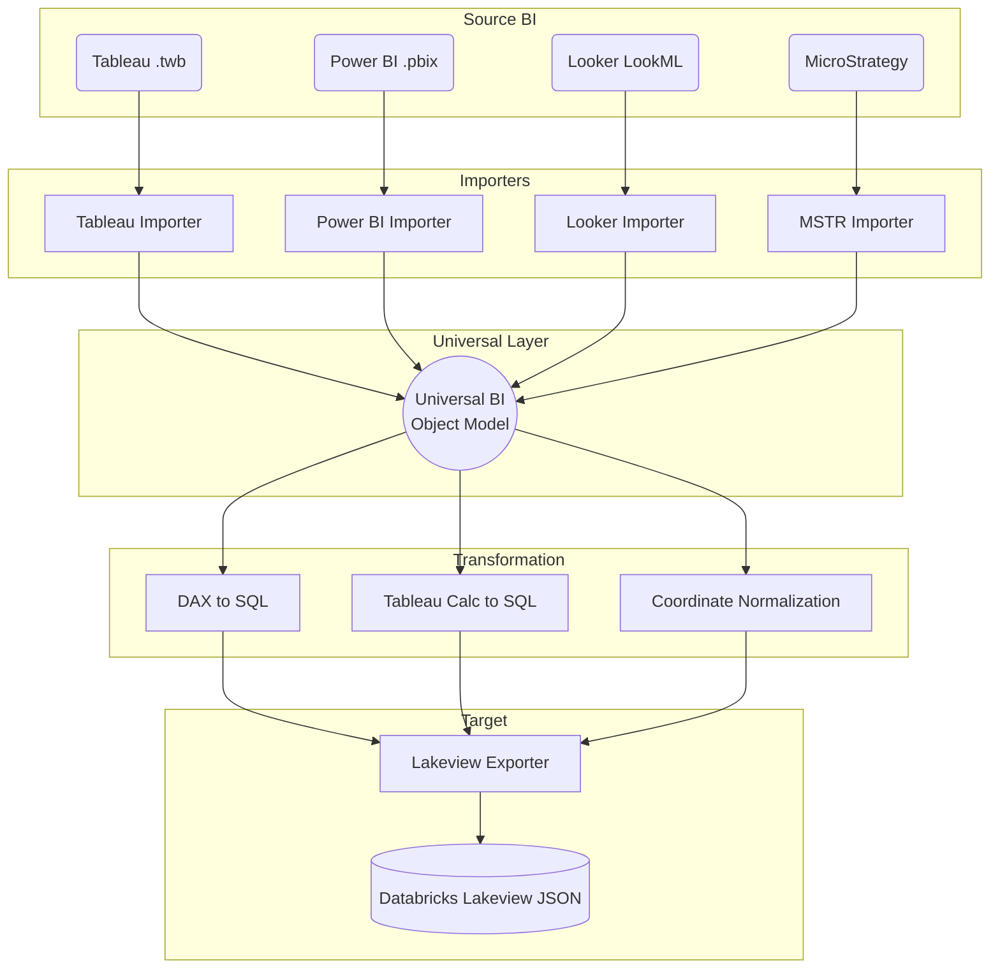

# PHASE 10 — UNIVERSAL BI OBJECT MODEL: Exhaustive Technical Plan

## 1. Introduction

This document outlines the complete, implementation-level technical plan for the Universal BI Object Model, a vendor-neutral intermediate translation layer designed to bridge the gap between source Business Intelligence (BI) platforms (Tableau, Power BI, Looker, MicroStrategy, Qlik, SAP BusinessObjects) and Databricks Lakeview. 

The Universal BI Object Model acts as the lingua franca of this migration framework. By standardizing the diverse conceptual structures of legacy BI tools into a single, cohesive, abstract representation, we decouple the extraction (Importer) logic from the generation (Exporter) logic. This ensures that any new BI platform can be supported simply by writing an Importer to this Universal Model, and any changes in the target Lakeview format only require updates to a single Exporter.

This model normalizes concepts such as visual encodings, cross-filtering, layout paradigms, and calculated expressions into a structured, unified format.

---

## 2. Core Object Hierarchy

The Core Object Hierarchy defines the atomic and composite structures that make up a dashboard. Every class, field, type, and relationship is explicitly defined.

### 2.1 Enums

**WidgetType**
- `CHART`: Visual data representations (bar, line, pie, etc.)
- `TABLE`: Tabular data representations (flat table, pivot table)
- `FILTER`: Interactive input controls for filtering data
- `TEXT`: Static or dynamic text blocks (titles, markdown, dynamic text)
- `IMAGE`: Static images or icons
- `KPI`: Single-value indicators, sparklines, or scorecards

**ChartType**
- `BAR`, `LINE`, `AREA`, `SCATTER`, `PIE`, `HEATMAP`, `HISTOGRAM`, `BOXPLOT`, `COMBO`, `MAP`
- `TABLE`, `PIVOT`
- `COUNTER`, `TEXT`
- `FILTER_MULTI`, `FILTER_SINGLE`, `FILTER_DATE`, `FILTER_RANGE`

**EncodingChannel**
- `X`: Horizontal axis or primary dimension
- `Y`: Vertical axis or primary measure
- `COLOR`: Color encoding for dimensions or measures
- `SIZE`: Size encoding for marks (e.g., scatter plot bubbles)
- `SHAPE`: Shape encoding for marks
- `LABEL`: Text labels attached to marks
- `TOOLTIP`: Extra data fields shown on hover
- `DETAIL`: Level of detail fields (creates marks without spatial encoding)
- `ANGLE`: Angular encoding (e.g., pie slices)

**AggregationType**
- `SUM`, `AVG`, `COUNT`, `COUNTD` (Count Distinct), `MIN`, `MAX`, `MEDIAN`, `NONE`

**ScaleType**
- `QUANTITATIVE`: Continuous numerical values
- `TEMPORAL`: Time-based values
- `CATEGORICAL`: Discrete, non-ordered categories
- `ORDINAL`: Discrete, ordered categories

**SortOrder**
- `ASC`: Ascending order
- `DESC`: Descending order
- `NONE`: Original or data-source order

**FieldRole**
- `DIMENSION`: Qualitative data, used for grouping
- `MEASURE`: Quantitative data, used for aggregations

**DataType**
- `STRING`, `INTEGER`, `FLOAT`, `DATE`, `DATETIME`, `BOOLEAN`, `GEOGRAPHY`

**FilterType**
- `MULTI_SELECT`, `SINGLE_SELECT`, `DATE_RANGE`, `RANGE` (Numeric), `RELATIVE_DATE`, `TOP_N`, `WILDCARD`, `CONDITION`

**FilterScope**
- `GLOBAL`: Applies to the entire dashboard
- `PAGE`: Applies to the specific page/sheet
- `WIDGET`: Applies only to a specific widget

**ParameterValueType**
- `ALL`: Any value matching the data type
- `LIST`: A discrete list of specific values
- `RANGE`: A continuous range with min/max and optional step size

**InteractionType**
- `CROSS_FILTER`: Clicking a mark filters other widgets
- `HIGHLIGHT`: Clicking/hovering a mark highlights related marks elsewhere
- `URL_ACTION`: Clicking a mark opens a URL
- `DRILL_DOWN`: Clicking a mark expands the hierarchy
- `PARAMETER_ACTION`: Clicking a mark updates a parameter value

**ActionType**
- `FILTER`, `HIGHLIGHT`, `URL`, `GOTO_SHEET`, `SET`, `PARAMETER`

**TriggerType**
- `SELECT`: Triggered on click
- `HOVER`: Triggered on mouse hover
- `MENU`: Triggered via context menu

---

### 2.2 Classes

#### IntermediateDashboard
The root object representing an entire dashboard or report application.
- `id` (str): Unique identifier for the dashboard.
- `name` (str): Internal name.
- `description` (str): Optional description.
- `version` (str): Source version (e.g., "2021.4").
- `createdAt` (str): ISO-8601 timestamp.
- `modifiedAt` (str): ISO-8601 timestamp.
- `pages` (List[IntermediatePage]): Ordered list of pages/tabs/sheets.
- `datasets` (List[IntermediateDataset]): List of data models used in the dashboard.
- `parameters` (List[IntermediateParameter]): Global variables and parameters.
- `theme` (IntermediateTheme): Global styling properties.
- `metadata` (Dict[str, Any]): Platform-specific metadata (e.g., `source_platform`, `original_path`, `migration_status`, `tags`).

#### IntermediatePage
A single tab, sheet, or page within a dashboard.
- `id` (str): Unique identifier.
- `name` (str): Internal identifier.
- `displayName` (str): User-facing title.
- `order` (int): 0-indexed position in the dashboard tab order.
- `widgets` (List[IntermediateWidget]): Visual elements on the page.
- `layout` (IntermediateLayout): Grid or absolute layout configuration for the page.
- `filters` (List[IntermediateFilter]): Filters specifically scoped to this page.

#### IntermediateWidget
A discrete container on a page, holding a chart, text, filter control, or image.
- `id` (str): Unique identifier.
- `name` (str): Internal identifier.
- `displayName` (str): Visible title of the widget.
- `type` (WidgetType): The high-level category of the widget.
- `visualization` (Optional[IntermediateVisualization]): Details of the chart/table (if `type` is CHART/TABLE/KPI/FILTER).
- `dataBinding` (Optional[IntermediateDataBinding]): Connection to a specific dataset.
- `position` (IntermediatePosition): Coordinates and sizing within the page layout.
- `interactions` (List[IntermediateInteraction]): Widget-level interactivity logic.
- `formatting` (Optional[IntermediateFormatting]): Border, background, padding, and title styling.

#### IntermediateVisualization
The internal blueprint of a visual chart.
- `chartType` (ChartType): The specific rendering type (e.g., BAR, PIE).
- `encodings` (Dict[EncodingChannel, IntermediateEncoding]): Maps visual channels (x, y, color) to data fields.
- `mark` (IntermediateMark): Properties of the graphical marks (e.g., line thickness, shape type).
- `axes` (Dict[str, IntermediateAxis]): Configuration for X/Y axes (titles, gridlines, tick formats).
- `legend` (Optional[IntermediateLegend]): Configuration for legends (position, visibility).
- `referenceLines` (List[IntermediateReferenceLine]): Static or dynamic reference lines/bands on the visualization.

#### IntermediateEncoding
Maps a data field to a visual channel.
- `channel` (EncodingChannel): The visual channel being mapped.
- `field` (str): The name of the field in the dataset.
- `aggregation` (AggregationType): The aggregation applied to the field.
- `scaleType` (ScaleType): How the data is mapped to visual space.
- `sort` (SortOrder): Sorting applied to this encoding.
- `format` (Optional[str]): Number or date format pattern (e.g., "#,##0.00", "YYYY-MM-DD").
- `displayName` (Optional[str]): Custom label for this encoding (overrides field name).

#### IntermediateMark
Defines the style of the rendered data points.
- `type` (str): Explicit mark type if applicable.
- `colors` (List[str]): Fixed colors or palette hex codes.
- `opacity` (float): 0.0 to 1.0 transparency.
- `size` (float): Fixed size of the mark.

#### IntermediateAxis
- `title` (str): Custom axis title.
- `visible` (bool): Whether the axis is shown.
- `gridlines` (bool): Whether gridlines are drawn.
- `scale` (str): "LINEAR", "LOG", etc.

#### IntermediateLegend
- `position` (str): "TOP", "BOTTOM", "LEFT", "RIGHT", "NONE".
- `title` (Optional[str]): Legend title.

#### IntermediateReferenceLine
- `axis` (str): Which axis the line applies to (e.g., "y").
- `value` (Union[float, str]): A static value or an expression (e.g., "AVERAGE(Profit)").
- `label` (str): Text label for the line.
- `color` (str): Hex color.

#### IntermediateDataset
Represents a source of data (Query, Table, or Model).
- `id` (str): Unique identifier.
- `name` (str): Internal name.
- `displayName` (str): User-facing name.
- `query` (str): SQL query or equivalent extraction logic.
- `columns` (List[IntermediateColumn]): Schema definition.
- `parameters` (List[IntermediateParameter]): Parameters passed into the dataset query.
- `sourceConnection` (Optional[IntermediateConnection]): details of the database/connection.
- `calculatedFields` (List[IntermediateCalculatedField]): Client-side derivations.
- `filters` (List[IntermediateFilter]): Dataset-level (data source) filters.
- `joins` (List[IntermediateJoin]): Relational definitions if multiple tables are modeled.

#### IntermediateColumn
Defines a single column in a dataset.
- `name` (str): Physical name.
- `displayName` (str): Logical/Presentation name.
- `dataType` (DataType): Type of data.
- `role` (FieldRole): DIMENSION or MEASURE.
- `aggregation` (AggregationType): Default aggregation.
- `expression` (Optional[str]): Formula if this is a calculated field.

#### IntermediateFilter
Defines a filter condition applied at the dataset, page, or widget level.
- `id` (str): Unique identifier.
- `name` (str): Display name for the filter control.
- `field` (str): Target field name.
- `filterType` (FilterType): The UI or logical type of the filter.
- `values` (Optional[List[Any]]): Included/Excluded values for list filters.
- `range` (Optional[Dict[str, float]]): `min` and `max` for range filters.
- `condition` (Optional[str]): Custom conditional logic.
- `scope` (FilterScope): Where the filter applies.
- `crossFilterTargets` (List[str]): List of target widget IDs affected by this filter.

#### IntermediateParameter
A user-adjustable variable.
- `id` (str): Unique identifier.
- `name` (str): Display name.
- `dataType` (DataType): Data type of the parameter.
- `currentValue` (Any): Current runtime value.
- `defaultValue` (Any): Default fallback value.
- `allowableValues` (ParameterValueType): Constraint on values.
- `valueList` (Optional[List[Any]]): Allowed values if type is LIST.
- `rangeMin`, `rangeMax`, `stepSize` (Optional[float]): Constraints if type is RANGE.

#### IntermediatePosition
Defines spatial layout characteristics.
- `x` (float): Horizontal position (normalized 0.0 to 1.0, or relative grid coordinate).
- `y` (float): Vertical position.
- `width` (float): Normalized width.
- `height` (float): Normalized height.
- `zIndex` (int): Stacking order.
- `container` (Optional[str]): ID of the parent container if nested.

#### IntermediateLayout
- `gridColumns` (int): Number of grid columns (default 6 for Lakeview).
- `positions` (List[IntermediatePosition]): Flat list of spatial coordinates matching widgets.
- `containerHierarchy` (Optional[Dict]): Tree structure of horizontal/vertical containers for flexbox/nested layouts.

#### IntermediateTheme
- `colorPalette` (List[str]): Array of hex color codes for sequential/categorical mapping.
- `backgroundColor` (str): Page background color.
- `fontFamily` (str): Default font.
- `fontSize` (int): Base font size.
- `darkMode` (bool): Theme variant.

#### IntermediateInteraction & IntermediateAction
- `type` (InteractionType/ActionType): Type of interactive behavior.
- `triggerOn` (TriggerType): User action triggering the behavior.
- `sourceWidget` / `sourceSheet` (str): Origin of the action.
- `targetWidgets` / `targetSheet` (List[str] / str): Destinations affected.
- `fields` / `fieldMappings` (Dict[str, str]): How context is passed from source to target.

---

## 3. Platform-Specific Importers

The Importers translate proprietary BI metadata into the Universal Model. This section outlines the specific mappings and edge case handlers.

### 3.1 Tableau Importer
Tableau uses XML (`.twb`) and packaged zip archives (`.twbx`).

- **Dashboard Mapping:**
  - `/workbook` -> `IntermediateDashboard`
  - `/workbook/dashboards/dashboard` -> `IntermediatePage`
  - `/workbook/worksheets/worksheet` -> Mapped selectively if placed on a dashboard, or as separate `IntermediatePage` objects if hidden/standalone.
- **Dataset Mapping:**
  - `/workbook/datasources/datasource` -> `IntermediateDataset`
  - Tableau Custom SQL -> `IntermediateDataset.query`
  - Tableau logical tables -> `IntermediateDataset.joins`
  - `/datasource/column` -> `IntermediateColumn`
  - `/datasource/column[calculation]` -> `IntermediateColumn` (with `expression` translated via dialect transformer).
- **Visualization Mapping:**
  - Tableau `pane` and `mark` -> `IntermediateVisualization`
  - `encodings`: Mapped from `/worksheet/table/rows` (Y), `cols` (X), and `/worksheet/table/pane/encodings`.
  - Tableau shapes/colors -> `IntermediateMark`
- **Layout Mapping:**
  - Tableau `zone` elements inside `dashboard` provide nested X/Y/W/H in a 100000x100000 coordinate space. Importer normalizes these by dividing by 100000 to get `0.0-1.0` `IntermediatePosition`.
- **Interactions:**
  - `/workbook/actions/action` -> `IntermediateAction`. Filter actions map to `InteractionType.CROSS_FILTER`.

### 3.2 Power BI Importer
Power BI uses a ZIP structure (`.pbix`) containing JSON reports and a tabular data model.

- **Dashboard Mapping:**
  - `Report/Layout` JSON -> `IntermediateDashboard`
  - `sections` -> `IntermediatePage`
- **Dataset Mapping:**
  - `DataModelSchema` JSON -> `IntermediateDataset`
  - Tabular tables/columns -> `IntermediateColumn`
  - DAX Measures -> `IntermediateColumn` (with `expression` containing DAX). Note: The DAX-to-SparkSQL translator is required for Lakeview compatibility.
- **Visualization Mapping:**
  - `visualContainers` -> `IntermediateWidget`
  - `config/singleVisual/visualType` -> Maps to `WidgetType` / `ChartType`.
  - `projections` (Values, Category, Series) -> `IntermediateEncoding` (Y, X, COLOR).
- **Layout Mapping:**
  - `x`, `y`, `width`, `height` in pixels -> Converted to normalized coordinates based on the page's `displayOption` bounds.

### 3.3 Looker Importer
Looker uses LookML (models, views, explores) and JSON/YAML for Dashboards.

- **Dataset Mapping:**
  - LookML `explore` -> `IntermediateDataset`
  - LookML `view` `dimensions` / `measures` -> `IntermediateColumn`
  - LookML `sql` parameter -> Mapped to `expression`.
- **Dashboard Mapping:**
  - Dashboard YAML/JSON -> `IntermediateDashboard`
  - `elements` -> `IntermediateWidget`
  - Looker `type` (e.g., `looker_column`, `looker_pie`) -> `ChartType`
- **Layout Mapping:**
  - Looker grid system -> Normalized to `IntermediatePosition` or mapped via `containerHierarchy`.

### 3.4 MicroStrategy Importer
MicroStrategy metadata is extracted via REST APIs.

- **Mapping Strategy:**
  - Dossier / Document -> `IntermediateDashboard`
  - Chapter / Page -> `IntermediatePage`
  - Visualization -> `IntermediateWidget` + `IntermediateVisualization`
  - Attributes / Metrics -> `IntermediateColumn` (`DIMENSION` / `MEASURE`)
  - Datasets (Cubes/Reports) -> `IntermediateDataset`

### 3.5 Qlik Importer
Qlik Sense uses a JSON-based object model extracted via the Engine API or `.qvf` unpacking.

- **Mapping Strategy:**
  - App -> `IntermediateDashboard`
  - Sheet (`sheet`) -> `IntermediatePage`
  - Objects (`barchart`, `piechart`) -> `IntermediateWidget`
  - HyperCubeDef (Dimensions, Measures) -> `IntermediateEncoding`
  - Qlik expressions (Set Analysis) -> Captured in `expression` for translation.

### 3.6 SAP BusinessObjects Importer
Web Intelligence (WebI) documents extracted via REST API.

- **Mapping Strategy:**
  - Document -> `IntermediateDashboard`
  - Report -> `IntermediatePage`
  - Block -> `IntermediateWidget`
  - Data Provider (Query) -> `IntermediateDataset`
  - Variables / Formulas -> `IntermediateCalculatedField`

---

## 4. Lakeview Exporter

The Lakeview Exporter is responsible for digesting the Universal Model and producing valid Databricks Lakeview JSON definitions.

### 4.1 Structural Mapping
- **`IntermediateDashboard`** -> Root Lakeview Dashboard JSON object.
- **`IntermediatePage`** -> Elements of the `pages` array.
- **`IntermediateDataset`** -> Elements of the `datasets` array. Note: Queries must be valid Databricks SQL.
- **`IntermediateWidget`** -> Elements of the `layout` array inside a page.

### 4.2 Visualization Exporter
Lakeview uses specific visualization specs.
- `IntermediateVisualization` where `ChartType.BAR` -> Lakeview `bar` chart spec.
- `EncodingChannel.X` -> `x_axis_field`
- `EncodingChannel.Y` -> `y_axis_fields`
- `EncodingChannel.COLOR` -> `group_by_field`
- `AggregationType` -> Pushed into the `query` or `calculatedField` if Lakeview requires pre-aggregation, or mapped to Lakeview's internal aggregation enums.

### 4.3 Layout Translation
Lakeview uses a 6-column grid system.
- `IntermediatePosition` (normalized 0.0-1.0) -> Multiplied by 6 to map to Lakeview's `x` and `width` grid columns.
- Vertical layout -> Mapped to Lakeview's block/row sequencing based on sorted Y-coordinates.
- Overlapping widgets (`zIndex`) -> Not natively supported in Lakeview's strict grid; the exporter flattens overlaps or issues a warning metadata tag.

### 4.4 Filter and Parameter Exporter
- `IntermediateFilter` (Type: `MULTI_SELECT`) -> Lakeview `filter-multi-select` widget.
- `IntermediateFilter` (Type: `DATE_RANGE`) -> Lakeview `filter-date-range-picker` widget.
- Bindings -> The exporter traverses `crossFilterTargets` to set up Lakeview's dataset parameter bindings or cross-filtering rules.

---

## 5. JSON Schema for the Intermediate Model

```json
{
  "$schema": "https://json-schema.org/draft/2020-12/schema",
  "title": "Universal BI Object Model",
  "type": "object",
  "properties": {
    "id": { "type": "string" },
    "name": { "type": "string" },
    "version": { "type": "string" },
    "pages": {
      "type": "array",
      "items": { "$ref": "#/$defs/IntermediatePage" }
    },
    "datasets": {
      "type": "array",
      "items": { "$ref": "#/$defs/IntermediateDataset" }
    },
    "theme": { "$ref": "#/$defs/IntermediateTheme" }
  },
  "required": ["id", "pages", "datasets"],
  "$defs": {
    "IntermediatePage": {
      "type": "object",
      "properties": {
        "id": { "type": "string" },
        "displayName": { "type": "string" },
        "widgets": {
          "type": "array",
          "items": { "$ref": "#/$defs/IntermediateWidget" }
        },
        "layout": { "$ref": "#/$defs/IntermediateLayout" }
      },
      "required": ["id", "widgets"]
    },
    "IntermediateWidget": {
      "type": "object",
      "properties": {
        "id": { "type": "string" },
        "type": { "type": "string", "enum": ["CHART", "TABLE", "FILTER", "TEXT", "IMAGE", "KPI"] },
        "visualization": { "$ref": "#/$defs/IntermediateVisualization" },
        "position": { "$ref": "#/$defs/IntermediatePosition" }
      },
      "required": ["id", "type", "position"]
    },
    "IntermediateDataset": {
      "type": "object",
      "properties": {
        "id": { "type": "string" },
        "query": { "type": "string" },
        "columns": {
          "type": "array",
          "items": {
            "type": "object",
            "properties": {
              "name": { "type": "string" },
              "dataType": { "type": "string" },
              "role": { "type": "string", "enum": ["DIMENSION", "MEASURE"] }
            }
          }
        }
      },
      "required": ["id", "query", "columns"]
    },
    "IntermediateVisualization": {
      "type": "object",
      "properties": {
        "chartType": { "type": "string" },
        "encodings": { "type": "object" }
      }
    },
    "IntermediatePosition": {
      "type": "object",
      "properties": {
        "x": { "type": "number" },
        "y": { "type": "number" },
        "width": { "type": "number" },
        "height": { "type": "number" }
      }
    },
    "IntermediateLayout": {
      "type": "object",
      "properties": {
        "gridColumns": { "type": "integer", "default": 6 }
      }
    },
    "IntermediateTheme": {
      "type": "object",
      "properties": {
        "colorPalette": { "type": "array", "items": { "type": "string" } },
        "darkMode": { "type": "boolean" }
      }
    }
  }
}
```

---

## 6. Mermaid Diagrams

### 6.1 Class Diagram



### 6.2 Data Model Entity-Relationship Diagram (ERD)



### 6.3 Importer to Exporter Pipeline Flow


