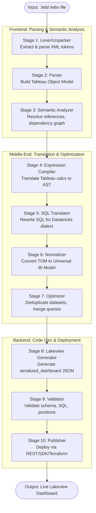

# PHASE 11 — MIGRATION COMPILER DESIGN: Tableau to Databricks

This exhaustive, implementation-level technical plan describes the compiler architecture for the Tableau → Databricks migration engine. The migration compiler translates Tableau constructs into the Databricks Lakeview platform, maintaining high fidelity of behavior, semantics, and visualization rendering.

## 1. Compiler Pipeline Overview

The compiler is organized as a multi-stage pipeline, leveraging a universal intermediate representation and a highly modular, decoupled architecture.



## 2. Stage Details

### Stage 1: Lexer/Unpacker

*   **Input Contract:** Raw byte stream or file path pointing to a `.twb` (XML) or `.twbx` (ZIP).
*   **Output Contract:** A normalized, UTF-8 encoded XML Document Object representing the Tableau configuration, along with a temporary directory containing any extracted artifacts (like local `.hyper` extracts or image assets).
*   **Processing Logic:**
    1.  Detect file magic bytes. If ZIP (`.twbx`), extract contents to a secure temp directory.
    2.  Locate the `.twb` payload inside the extracted directory.
    3.  Read bytes, detect encoding (UTF-8, UTF-16, ISO-8859-1).
    4.  Parse XML using `lxml.etree`.
    5.  Execute an initial schema sanitization (stripping non-standard namespaces if any).
*   **Error Handling Strategy:** Catch `zipfile.BadZipFile`, `UnicodeDecodeError`, `lxml.etree.XMLSyntaxError`. Attempt recovery by skipping corrupted non-essential artifacts (e.g., corrupted images).
*   **Logging & Telemetry:** Log file size, compression ratio, XML parse duration, node count, and encoding type.
*   **Configuration Options:** `temp_dir_path`, `max_extract_size_bytes`, `strict_xml_validation`.
*   **Test Strategy:** Provide corrupted `.twbx`, oversized files, missing `.twb` files, and malformed XML files to assert correct exception mapping and recovery.

### Stage 2: Parser

*   **Input Contract:** Validated `lxml.etree` root element of the `.twb` file.
*   **Output Contract:** In-memory Tableau Object Model (TOM) graph (classes: `TableauWorkbook`, `TableauDatasource`, etc.).
*   **Processing Logic:**
    1.  Identify Tableau version (e.g., `version="18.1"`).
    2.  Instantiate version-specific parser plugin.
    3.  Extract Datasources: parse connections, relations, logical tables (post-2020.2) or physical tables (pre-2020.2).
    4.  Extract Worksheets: parse shelves, columns, rows, filters, marks.
    5.  Extract Dashboards: parse zones, sizes, device layouts.
*   **Error Handling Strategy:** Unrecognized XML tags emit a `WARNING` and are stored in an `unparsed_elements` map for post-migration manual review.
*   **Logging & Telemetry:** Count of objects parsed (e.g., 5 datasources, 12 worksheets).
*   **Configuration Options:** `ignore_hidden_sheets`, `fallback_parser_version`.
*   **Test Strategy:** Unit tests for parsing complex logical models vs physical joins, and verification of parsing parameters/sets.

### Stage 3: Semantic Analyzer

*   **Input Contract:** Raw Tableau Object Model (TOM).
*   **Output Contract:** Semantically enriched TOM with a resolved dependency graph.
*   **Processing Logic:**
    1.  Iterate over all calculated fields, actions, and filters.
    2.  Resolve string references `[Category]` to specific `TableauColumn` objects.
    3.  Build a directed acyclic graph (DAG) of dependencies.
    4.  Type inference: Infer output types of calculated fields based on operand types.
    5.  Cycle detection: Walk the DAG to detect circular references.
*   **Error Handling Strategy:** Dangling references (fields deleted in DB but still referenced in calcs) raise a `ValidationError` (ERROR severity, drops the calc but retains the rest of the sheet). Circular dependencies cause FATAL termination for that specific sheet.
*   **Logging & Telemetry:** Log DAG depth, max branching factor, and count of resolved vs dangling references.
*   **Configuration Options:** `strict_type_checking`, `allow_dangling_refs_as_nulls`.
*   **Test Strategy:** Synthesize TOM graphs with missing references, mismatched types (e.g., string + int), and intentional cycles to validate failure modes.

### Stage 4: Expression Compiler

*   **Input Contract:** Enriched TOM with raw Tableau calculation strings.
*   **Output Contract:** TOM with fully translated Databricks SQL expression strings attached to each calculation node.
*   **Processing Logic:**
    1.  Lexical scanning of Tableau calculation string.
    2.  Parse into an AST using a Pratt Parser or ANTLR4 generated parser for Tableau expression grammar.
    3.  AST Tree Nodes: `FunctionCall`, `FieldRef`, `Literal`, `BinaryOp`, `UnaryOp`, `LODExpr`.
    4.  Visitor Pattern: Traversal via `TableauToSQLVisitor`.
    5.  Translate LODs:
        *   `FIXED` -> `SUM(measure) OVER (PARTITION BY dims)` or correlated subquery based on context.
    6.  Translate Table Calcs: Map `RUNNING_SUM`, `WINDOW_AVG` to standard ANSI Window functions.
*   **Error Handling Strategy:** Unsupported functions map to `UNSUPPORTED_FUNC(...)` macro in SQL and flag a WARNING.
*   **Logging & Telemetry:** Translation success rate %, count of unsupported functions encountered.
*   **Configuration Options:** `enable_lod_translation`, `default_tz_offset`.
*   **Test Strategy:** Exhaustive parameterized tests matching Tableau expressions to target Databricks SQL for all supported functions.

### Stage 5: SQL Translator

*   **Input Contract:** Custom SQL queries embedded in Tableau Datasources.
*   **Output Contract:** Databricks-dialect SQL queries.
*   **Processing Logic:**
    1.  Parse Custom SQL using `sqlglot`.
    2.  Apply dialect translation (`dialect="tableau"` to `dialect="databricks"`).
    3.  Rewrite patterns (e.g., convert `DATEADD` specific syntax, string concatenations).
    4.  Extract and inject Tableau Parameters embedded in Custom SQL as Databricks named parameters or session variables.
*   **Error Handling Strategy:** If `sqlglot` fails to parse, pass-through the SQL as-is with a WARNING and flag for manual intervention.
*   **Logging & Telemetry:** Log SQL complexity score, and dialect rewrite success.
*   **Configuration Options:** `sql_dialect_fallback`, `enable_predicate_pushdown`.
*   **Test Strategy:** AST comparison of input vs output SQL strings using known divergent dialect patterns (e.g., CTEs, date functions).

### Stage 6: Normalizer

*   **Input Contract:** Enriched and translated TOM.
*   **Output Contract:** Universal BI Model (UBIM) representation.
*   **Processing Logic:**
    1.  Map TOM visual configurations to a generalized UBIM grammar.
    2.  `TableauWorksheet` -> `UBIMChart`.
    3.  Map Mark Types (Bar, Line, Circle) -> `ChartType`.
    4.  Map Shelves (Rows, Columns, Color, Size) -> `EncodingChannel` (X, Y, Color, Size).
    5.  Normalize Layout: Convert absolute pixel positions (from Tableau dashboards) to responsive grid layouts based on 12-column systems or relative percentages.
*   **Error Handling Strategy:** Unmappable visualizations (e.g., custom polygons, complex dual-axes) gracefully degrade to tabular representations or simple bar charts (WARNING).
*   **Logging & Telemetry:** Visual downgrade occurrences.
*   **Configuration Options:** `default_fallback_chart`, `grid_snap_tolerance`.
*   **Test Strategy:** Snapshot testing of UBIM JSON outputs for varied Tableau workbook layouts.

### Stage 7: Optimizer

*   **Input Contract:** UBIM.
*   **Output Contract:** Optimized UBIM.
*   **Processing Logic:**
    1.  **Dataset Deduplication:** Identify datasets with identical source connections and logical tables. Merge them into a single UBIM Dataset definition.
    2.  **Query Merging:** Consolidate required fields from multiple charts into unified dataset queries to reduce backend load.
    3.  **Layout Compaction:** Remove empty containers, merge adjacent text blocks, normalize paddings.
    4.  **Pruning:** Remove unused datasets, parameters, and calc fields (Garbage Collection).
*   **Error Handling Strategy:** Internal invariant checks to ensure no referenced field is accidentally pruned.
*   **Logging & Telemetry:** Optimization yield (e.g., "Reduced datasets from 10 to 3", "Pruned 24 unused fields").
*   **Configuration Options:** `enable_deduplication`, `aggressive_pruning`.
*   **Test Strategy:** Diff analysis of pre-optimization vs post-optimization UBIM size and semantic equivalence.

### Stage 8: Lakeview Generator

*   **Input Contract:** Optimized UBIM.
*   **Output Contract:** Databricks Lakeview `serialized_dashboard` JSON payload.
*   **Processing Logic:**
    1.  Generate 8-character hex IDs for all entities (`datasets`, `pages`, `widgets`).
    2.  Translate UBIM Datasets to Lakeview `datasets` array (SQL strings, parameter bindings).
    3.  Translate UBIM Charts to Lakeview `widgets` array. Map UBIM ChartTypes to `databricks-sql-viz` types.
    4.  Translate grid layouts to Lakeview's positional model (`x`, `y`, `width`, `height`).
    5.  Map cross-filters to `associative_filter_predicate_group`.
*   **Error Handling Strategy:** Schema mismatch triggers FATAL error (must ensure output perfectly aligns with Lakeview expectations).
*   **Logging & Telemetry:** Output JSON size, count of generated widgets and pages.
*   **Configuration Options:** `default_theme`, `color_palette_override`.
*   **Test Strategy:** JSON Schema validation against the verified Phase 7 Lakeview Schema.

### Stage 9: Validator

*   **Input Contract:** Lakeview JSON payload.
*   **Output Contract:** Validated Lakeview JSON payload (or failure report).
*   **Processing Logic:**
    1.  Schema Validation: `jsonschema.validate(payload, LAKEVIEW_SCHEMA)`.
    2.  SQL Validation: Parse embedded SQL queries using `sqlparse` to ensure syntax integrity.
    3.  Referential Integrity: Ensure all `dataset` UUIDs referenced in widgets exist in the `datasets` array.
    4.  Layout Validation: Ensure widgets do not overlap or exceed grid boundaries.
*   **Error Handling Strategy:** Any validation failure results in FATAL status for the migration, dumping the error trace and the invalid JSON for debugging.
*   **Logging & Telemetry:** Validation time, schema violation details.
*   **Configuration Options:** `strict_layout_validation`.
*   **Test Strategy:** Intentionally break JSON outputs (missing fields, overlaps) and assert that Validator catches them.

### Stage 10: Publisher

*   **Input Contract:** Validated Lakeview JSON.
*   **Output Contract:** Deployed Asset (Workspace URL) or generated Terraform configuration.
*   **Processing Logic:**
    1.  Based on target mode (`rest`, `sdk`, `terraform`):
    2.  **REST/SDK:** Authenticate via OAuth/PAT. Create dashboard via Databricks Workspace API. Publish payload. Handle rate limits.
    3.  **Terraform:** Wrap the JSON in a `databricks_dashboard` Terraform resource block and write to `.tf` file.
*   **Error Handling Strategy:** API failures trigger exponential backoff. Irrecoverable failures initiate a rollback (delete partially created dashboard).
*   **Logging & Telemetry:** API latency, deployment endpoint, success/fail status.
*   **Configuration Options:** `target_workspace_url`, `auth_profile`, `deployment_mode`.
*   **Test Strategy:** Mock Databricks REST API endpoints to simulate rate limits, unauthorized errors, and successful deployments.

## 3. Error Handling Strategy

The compiler employs a fault-tolerant, error-collection design.
*   **Don't Fail Fast:** Stages 1-8 accumulate errors rather than crashing on the first exception.
*   **Error Bag:** An `ErrorBag` object is passed through the pipeline.
*   **Severities:**
    *   **FATAL:** Pipeline must halt (e.g., unparseable XML, validation failure).
    *   **ERROR:** Component dropped (e.g., specific chart failed to translate), but pipeline continues.
    *   **WARNING:** Sub-optimal translation (e.g., unsupported function mapped to raw SQL, layout downgraded).
    *   **INFO:** Informational metrics.
*   **Migration Report:** Generated as an HTML artifact at the end of the run, detailing all WARNINGS and ERRORS to guide manual remediation.

## 4. Configuration System

Configuration is driven by a hierarchy: CLI arguments > YAML config file > Defaults.

```yaml
# migration_config.yaml
project:
  name: "finance_migration"
  version: "1.0"

compiler:
  log_level: "DEBUG"
  temp_dir: "/tmp/migration"
  fallback_parser_version: "2020.4"
  
translation:
  enable_lod_translation: true
  enable_predicate_pushdown: true
  target_catalog: "hive_metastore"
  target_schema: "finance_prod"
  
optimization:
  enable_deduplication: true
  
publisher:
  deployment_mode: "rest" # rest, sdk, terraform
  workspace_url: "https://adb-1234.azuredatabricks.net"
  timeout_seconds: 300
```

## 5. Plugin Architecture

To ensure the compiler can scale to other BI tools (e.g., PowerBI) or future target formats, the architecture is strictly plugin-based using Python's `entry_points` or dynamic module loading.

*   **Source Plugins:** Interface `ISourceParser`. Current implementation: `TableauParser`.
*   **Expression Plugins:** Custom translation handlers for specific function signatures. Interface `IExpressionTranslator`.
*   **Viz Plugins:** Rules for mapping source visual configs to UBIM.
*   **Target Plugins:** Interface `ITargetGenerator`. Current implementation: `LakeviewGenerator`.
