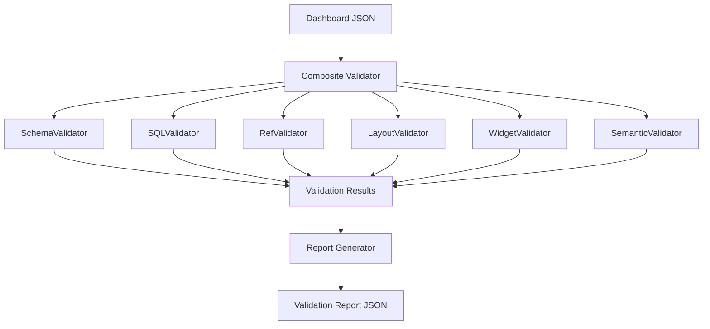

# Validation Engine Design

## Overview
The Validation Engine ensures that generated Databricks Lakeview Dashboard definitions are syntactically valid, semantically correct, and structurally consistent before deployment. This prevents runtime errors, malformed API requests, and broken dashboards.

## Architecture



## 1. Schema Validation
Validates the raw structure of the `serialized_dashboard` against a JSON Schema (Draft 2020-12).

### Scope
- **Required Fields**: Ensures `pages`, `datasets`, etc., exist.
- **Type Checking**: Strings, integers, arrays, objects.
- **Enum Validation**: Validates `widgetType` (e.g., `chart`, `table`), `scale.type` (e.g., `linear`, `categorical`).
- **Pattern Matching**: Validates IDs match `^[0-9a-f]{8}$`.

### Implementation (Python)
```python
from jsonschema import validate, ValidationError

class SchemaValidator:
    def __init__(self, schema_dict):
        self.schema = schema_dict
        
    def validate(self, dashboard_json):
        issues = []
        try:
            validate(instance=dashboard_json, schema=self.schema)
        except ValidationError as e:
            issues.append({
                "severity": "ERROR",
                "location": list(e.path),
                "message": e.message,
                "rule": "schema_compliance"
            })
        return issues
```

## 2. SQL Validation
Validates dataset queries.

### Scope
- **Syntax Validation**: Uses `sqlglot` to parse and detect syntax errors.
- **Table/Column Existence**: (Optional/Advanced) Cross-references Unity Catalog schemas.
- **Aggregation Mixing**: Detects invalid mixing of aggregated and non-aggregated columns.

```python
import sqlglot

class SQLValidator:
    def validate(self, dashboard_json):
        issues = []
        for ds in dashboard_json.get("datasets", []):
            query = ds.get("query", "")
            try:
                # Basic syntax check
                sqlglot.parse_one(query, read="spark")
            except sqlglot.errors.ParseError as e:
                issues.append({
                    "severity": "ERROR",
                    "location": ["datasets", ds.get("name"), "query"],
                    "message": f"SQL Parse Error: {str(e)}",
                    "rule": "valid_sql_syntax"
                })
        return issues
```

## 3. Reference Validation
Ensures all pointers within the dashboard resolve to valid entities.

### Scope
- Widget dataset references must point to defined `datasets`.
- Filter bindings must target existing dataset fields.
- No dangling references or orphaned datasets (datasets with no widgets).

## 4. Layout Validation
Ensures the 6-column grid layout is respected.

### Scope
- **Bounds**: `0 <= x <= 5`, `x + width <= 6`, `height >= 1`.
- **Collision Detection**: No two widgets on the same page can overlap in grid coordinates.

## 5. Widget Validation
Checks component-specific constraints.

### Scope
- Must have `spec` OR `textbox_spec` XOR.
- `spec.version` must match the known type category.
- **Encodings**:
  - `counter`: requires `value`.
  - `chart`: requires `x` and `y`.
  - `table`: requires `columns`.
  - `filter`: requires `fields`.

## 6. Cross-Referential Validation
- **Duplicate IDs**: Dataset names, page names, widget IDs must be unique globally or within their scope.
- **Circular Dependencies**: Detect loops in dataset parameterizations or filter chains.

## 7. Semantic Validation
- **Field Expressions**: Valid SQL column names or aggregations.
- **Type Compatibility**: e.g., Date functions only on date-typed fields.

## Validation Report Format

```json
{
  "summary": {
    "passed": false,
    "errors_count": 2,
    "warnings_count": 1
  },
  "issues": [
    {
      "severity": "ERROR",
      "location": ["pages", 0, "widgets", 1, "position"],
      "message": "Widget exceeds 6-column width limit (x=4, width=3).",
      "rule": "layout_bounds"
    }
  ]
}
```
