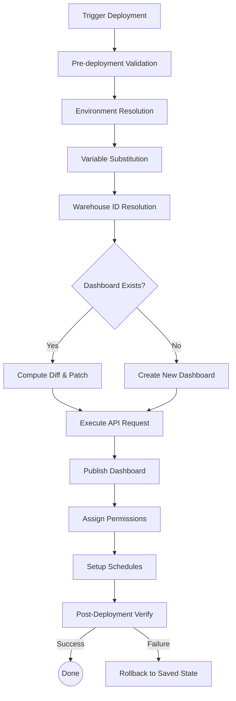

# Deployment Engine Design

## Overview
The Deployment Engine orchestrates the delivery of Databricks Lakeview dashboards across environments. It handles environment variable substitution, API interactions, validation, diff calculation, and lifecycle management (publishing, permissions).

## Deployment Modes
The engine supports multiple execution backends:
1. **REST API Direct**: Uses Python `requests` for zero-dependency execution.
2. **Databricks SDK**: Uses the official `databricks-sdk` for Python.
3. **CLI**: Wraps `databricks lakeview` commands.
4. **Terraform**: Generates `.tf` configurations for infrastructure-as-code deployments.
5. **Asset Bundles**: Generates `databricks.yml` and `.lvdash.json` for Databricks Asset Bundles (DABs).
6. **GitOps**: Facilitates PR-based review and deployment workflows.

## Deployment Pipeline



## Rollback Strategy
1. **Pre-flight Snapshot**: Before updating an existing dashboard, save the current `serialized_dashboard` and `etag`.
2. **Failure Handling**: If the update or publish step fails, use the saved state to issue a reverting `PATCH` request.
3. **New Dashboards**: If a newly created dashboard fails during publish/permissions, delete the dashboard.

## Multi-Environment Support & Variable Substitution
Environment-specific configurations are handled via YAML files (`dev.yml`, `staging.yml`, `prod.yml`).

### Variable Substitution
Placeholders in the SQL queries or dashboard specs (e.g., `${catalog}`, `${schema}`) are replaced based on the target environment before deployment.

**dev.yml**
```yaml
environment: dev
catalog: dev_catalog
schema: bi_sandbox
warehouse_id: abc123def456
```

## CI/CD Integration

### GitHub Actions Example
```yaml
name: Deploy Dashboard
on:
  push:
    branches: [main]
jobs:
  deploy:
    runs-on: ubuntu-latest
    steps:
      - uses: actions/checkout@v3
      - name: Set up Python
        uses: actions/setup-python@v4
      - name: Validate Dashboard
        run: python deploy.py validate dashboard.json
      - name: Deploy to Prod
        env:
          DATABRICKS_HOST: ${{ secrets.DB_HOST }}
          DATABRICKS_TOKEN: ${{ secrets.DB_TOKEN }}
        run: python deploy.py deploy dashboard.json --env prod
```
