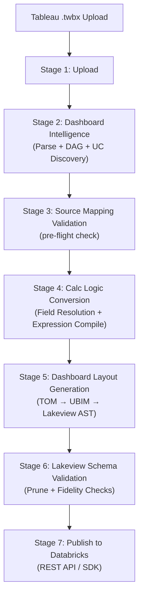

# Tableau → Databricks Lakeview Migration Pipeline
## Complete Technical & Business Knowledge Base
*Reverse-engineered from repository `c:\Users\madhu\Desktop\db-tb`*

---

## 01. Executive Overview

This system is a **semantic compiler pipeline** that transforms Tableau workbooks (`.twb` / `.twbx`) into Databricks AI/BI Lakeview dashboards (serialized JSON). It is a full-stack application with:

- **Backend**: Python (FastAPI) — parsing, normalization, SQL generation, validation, deployment
- **Frontend**: Next.js — multi-stage migration wizard UI
- **Database**: SQLite (via SQLAlchemy) — job/stage tracking, connection persistence

The pipeline preserves **business intent** — dimensions, measures, calculated fields, filters, visual types, and layout — through a chain of intermediate representations:

```
Tableau XML (TWB/TWBX)
      ↓
WorkbookMetadata (TOM — Tableau Object Model)
      ↓
Canonical Field Resolution + Expression Compilation
      ↓
IntermediateDashboard (UBIM — Universal BI Model)
      ↓
LakeviewDashboard (Lakeview AST)
      ↓
Serialized Lakeview JSON
      ↓
Databricks AI/BI Dashboard (via REST API / SDK)
```

### Key Design Decisions (Verified from Code)
- **Per-worksheet datasets**: Each Tableau worksheet gets its own SQL query/dataset (not shared)
- **WidgetFactory as single source of truth**: All Lakeview widget specs go through `WidgetFactory` — enforces schema versions, encoding rules
- **Deterministic IDs**: `stable_lakeview_id()` uses SHA-1 of content seeds for byte-identical re-renders
- **7-stage frontend pipeline**: Upload → Dashboard Intelligence → Source Mapping → Calc Logic Conversion → Layout Generation → Schema Validation → Publish

---

## 02. End-to-End Architecture



---

## 03. Repository Architecture

### Source Layout

| Directory | Purpose |
|-----------|---------|
| [src/app/models/](file:///c:/Users/madhu/Desktop/db-tb/src/app/models) | Pydantic/dataclass models: TOM, UBIM, Lakeview AST, Semantic Model, Stage tracking |
| [src/app/services/parser/](file:///c:/Users/madhu/Desktop/db-tb/src/app/services/parser) | TWB/TWBX XML parsing, dependency graph, workbook ontology, mark type resolution |
| [src/app/services/compiler/](file:///c:/Users/madhu/Desktop/db-tb/src/app/services/compiler) | Expression compilation, field resolution, function mapping, SQL translation |
| [src/app/services/normalizer/](file:///c:/Users/madhu/Desktop/db-tb/src/app/services/normalizer) | TOM → UBIM conversion (2443 lines — the largest single file) |
| [src/app/services/generator/](file:///c:/Users/madhu/Desktop/db-tb/src/app/services/generator) | UBIM → Lakeview AST, WidgetFactory, layout engine, layout stage artifacts |
| [src/app/services/mapper/](file:///c:/Users/madhu/Desktop/db-tb/src/app/services/mapper) | Datasource mapping, Unity Catalog discovery, matching engine |
| [src/app/services/validator/](file:///c:/Users/madhu/Desktop/db-tb/src/app/services/validator) | Lakeview JSON schema validation, widget pruning |
| [src/app/services/deployer/](file:///c:/Users/madhu/Desktop/db-tb/src/app/services/deployer) | Databricks REST API client, asset bundle generation |
| [src/app/services/reporter/](file:///c:/Users/madhu/Desktop/db-tb/src/app/services/reporter) | Migration report generation |
| [src/app/services/pipeline.py](file:///c:/Users/madhu/Desktop/db-tb/src/app/services/pipeline.py) | **Pipeline orchestrator** — `MigrationPipeline.run()` (973 lines) |
| [src/app/agents/](file:///c:/Users/madhu/Desktop/db-tb/src/app/agents) | LLM-powered expression agent, expression judge, viz recommendation agent |
| [src/app/api/v1/](file:///c:/Users/madhu/Desktop/db-tb/src/app/api/v1) | FastAPI routes: upload, migrations, stages, datasource mapping, connections, validation |
| [frontend/](file:///c:/Users/madhu/Desktop/db-tb/frontend) | Next.js frontend: dashboard wizard, mapping UI, preview, validation |
| [tests/](file:///c:/Users/madhu/Desktop/db-tb/tests) | 27 test files covering parser, compiler, generator, validator, pipeline |
| [demo_goldens/](file:///c:/Users/madhu/Desktop/db-tb/demo_goldens) | Golden reference Lakeview JSON: Claims Overview |
| [docs/](file:///c:/Users/madhu/Desktop/db-tb/docs) | 41 design/architecture documents |

### Core Data Models

| Model | File | Type | Purpose |
|-------|------|------|---------|
| `WorkbookMetadata` | [metadata.py](file:///c:/Users/madhu/Desktop/db-tb/src/app/models/metadata.py#L444-L487) | Pydantic | Tableau Object Model root — datasources, worksheets, dashboards, parameters, actions |
| `DatasourceMetadata` | [metadata.py](file:///c:/Users/madhu/Desktop/db-tb/src/app/models/metadata.py#L267-L288) | Pydantic | Tables, columns, calculated fields, joins, relationships, Databricks connection |
| `WorksheetMetadata` | [metadata.py](file:///c:/Users/madhu/Desktop/db-tb/src/app/models/metadata.py#L316-L384) | Pydantic | Visual spec: mark type, shelves, encodings, filters, sorts, complexity |
| `DashboardMetadata` | [metadata.py](file:///c:/Users/madhu/Desktop/db-tb/src/app/models/metadata.py#L415-L441) | Pydantic | Zones, filter controls, text zones, device layouts |
| `IntermediateDashboard` | [universal_model.py](file:///c:/Users/madhu/Desktop/db-tb/src/app/models/universal_model.py#L114-L120) | Pydantic | UBIM root — pages, datasets, widgets with encodings & query fields |
| `LakeviewDashboard` | [lakeview_model.py](file:///c:/Users/madhu/Desktop/db-tb/src/app/models/lakeview_model.py#L175-L199) | Pydantic | Lakeview AST — datasets, pages (layout items with widgets) |
| `SemanticModel` | [semantic_model.py](file:///c:/Users/madhu/Desktop/db-tb/src/app/models/semantic_model.py#L304-L560) | dataclass | Unity Catalog metadata: catalogs, schemas, tables, columns, relationships |

---

## 04. Tableau Workbook Ingestion

### Entry Point
- **File**: [tableau_extractor.py](file:///c:/Users/madhu/Desktop/db-tb/src/app/services/parser/tableau_extractor.py) (109,396 bytes — the largest source file)
- **Function**: `parse_workbook(file_path: str) → WorkbookMetadata`
- **Input**: Path to `.twb` or `.twbx` file
- **Output**: Fully populated `WorkbookMetadata`

### TWB vs TWBX Handling
- `.twbx`: ZIP archive — extracted to access inner `.twb` XML + Hyper extract files
- `.twb`: Direct XML parsing

### XML Parsing Flow (verified from pipeline.py L267–L605)
```
parse_workbook(file_path)
  ├─ extract TWBX archive (if applicable)
  ├─ parse XML DOM tree
  ├─ extract datasources → DatasourceMetadata[]
  │    ├─ connections (including federated)
  │    ├─ tables (including custom SQL)
  │    ├─ columns → ColumnMetadata[]
  │    ├─ calculated fields → CalculatedFieldMetadata[]
  │    ├─ joins → JoinRelationship[]
  │    ├─ relationships → RelationshipMetadata[]
  │    └─ Databricks connection detection
  ├─ extract worksheets → WorksheetMetadata[]
  │    ├─ shelves (rows, columns, pages)
  │    ├─ encodings (color, size, detail, tooltip, label, shape)
  │    ├─ mark type
  │    ├─ filters
  │    ├─ sorts
  │    ├─ axes, legends, analytics overlays
  │    └─ complexity scoring
  ├─ extract dashboards → DashboardMetadata[]
  │    ├─ zones (hierarchical zone tree)
  │    ├─ filter controls
  │    ├─ text zones
  │    └─ device layouts
  ├─ extract parameters → ParameterMetadata[]
  ├─ extract actions → ActionMetadata[]
  ├─ extract hierarchies, groups, sets, bins
  └─ build caption↔internal name maps
```

---

## 05. Tableau Ontology (From Code)

The internal ontology is implemented as Pydantic models in [metadata.py](file:///c:/Users/madhu/Desktop/db-tb/src/app/models/metadata.py). Each model maps directly to a Tableau XML element:

| Repository Class | Tableau XML Element | Purpose | Consumers | Lakeview Target |
|-----------------|---------------------|---------|-----------|-----------------|
| `WorkbookMetadata` | `<workbook>` | Root container | Pipeline orchestrator | Dashboard JSON root |
| `DatasourceMetadata` | `<datasource>` | Data connection + schema | SQL generator, mapper | Dataset SQL source |
| `ColumnMetadata` | `<column>` | Physical/calculated column | Field resolver | Query field expression |
| `CalculatedFieldMetadata` | `<column formula="...">` | Tableau formula | Expression compiler | Compiled SQL expression |
| `WorksheetMetadata` | `<worksheet>` | Visual specification | UBIM normalizer | Widget + query |
| `DashboardMetadata` | `<dashboard>` | Layout container | Layout engine | Page |
| `ShelfField` | `<rows>/<columns>` entries | Shelf bindings | Encoding resolver | x/y field mapping |
| `EncodingMetadata` | `<pane><encodings>` | Mark encodings | Visual converter | color/size/label channels |
| `FilterMetadata` | `<filter>` | Data filter | SQL WHERE clause | Query filter expression |
| `DatabricksConnectionInfo` | `<connection class="databricks">` | Databricks connection | UC discovery | Catalog/schema for FQN |
| `JoinRelationship` | `<relation join="...">` | Explicit join | SQL FROM clause | Dataset JOIN SQL |
| `RelationshipMetadata` | `<_.fcp.ObjectModelEncapsulateLegacy>` | Relationship model | Data model screen | Dataset JOIN SQL |

### Ontology Builder
- **File**: [workbook_ontology.py](file:///c:/Users/madhu/Desktop/db-tb/src/app/services/parser/workbook_ontology.py) (21,412 bytes)
- **Function**: `build_workbook_ontology(workbook_meta: WorkbookMetadata) → dict`
- Produces a comprehensive ontology dictionary used for frontend display and fidelity checks

### Dependency Graph
- **File**: [dependency_graph.py](file:///c:/Users/madhu/Desktop/db-tb/src/app/services/parser/dependency_graph.py) (7,981 bytes)
- **Class**: `DependencyGraphEngine`
- Builds DAG of calculated field dependencies; detects circular references

---

## 06. Dashboard Intelligence (Stage 2)

**Orchestrated by**: [pipeline.py L267–L611](file:///c:/Users/madhu/Desktop/db-tb/src/app/services/pipeline.py#L267-L611)

This stage combines:
1. **Parse** — `parse_workbook()` → `WorkbookMetadata`
2. **UC Auto-Discovery (Stage 3.5)** — triggered when Databricks connections detected
3. **Dependency Graph** — `DependencyGraphEngine.detect_cycles()`

### Stage 3.5: Unity Catalog Auto-Discovery
**Triggered when** (verified from [pipeline.py L887–L973](file:///c:/Users/madhu/Desktop/db-tb/src/app/services/pipeline.py#L887-L973)):
1. Workbook has ≥1 Databricks-type connection
2. `databricks_host` available (from connection metadata or env)
3. `databricks_token` available (from env/config — **never** from Tableau XML)

**Implementation**: [catalog_discovery_service.py](file:///c:/Users/madhu/Desktop/db-tb/src/app/services/mapper/catalog_discovery_service.py) (20,569 bytes)
- `CatalogDiscoveryService.discover()` → `SemanticModel`
- Connects to Databricks workspace, discovers catalogs/schemas/tables/columns/constraints
- Populates `SemanticModel` with `UCCatalog` → `UCSchema` → `UCTable` → `UCColumn`

### Output Artifacts
The stage produces rich artifacts for the frontend (verified from pipeline.py L553–L605):
- `detailed_visuals`: enriched worksheet metadata for Visual Intelligence Explorer
- `datasources`, `calculated_fields`, `parameters`, `filters`, `groups`, `sets`, `hierarchies`
- `actions`, `joins`, `relationships`
- `databricks_discovery`: UC discovery results (tables, columns, relationships)
- `workbook_ontology`: full ontology dictionary

---

## 07. Worksheet / Visual Intelligence

### Visual Type Detection
**File**: [mark_type_resolver.py](file:///c:/Users/madhu/Desktop/db-tb/src/app/services/parser/mark_type_resolver.py)
**Function**: `resolve_mark_type(raw_mark_type, cols, rows, measure_bindings) → str`

| Tableau Mark Type | Resolved Type | UBIM ChartType |
|-------------------|---------------|----------------|
| `bar` | `Bar Chart` | `BAR` |
| `line` | `Line Chart` | `LINE` |
| `area` | `Area Chart` | `AREA` |
| `circle` | `Scatter Plot` | `SCATTER` |
| `pie` | `Pie chart` | `PIE` |
| `square` / `heatmap` | `Heatmap (square)` | `HEATMAP` |
| `text` (single measure, no dims) | `Text Table / KPI` | `COUNTER` |
| `text` (with dims) | `Text table` | `TABLE` |
| `map` / `polygon` | `Map` / `Symbol Map` | `MAP` |
| `ganttbar` | `Gantt Bar` | `BAR` |
| `automatic` (dates + measures) | `Line Chart` | `LINE` |
| `automatic` (both axes measures) | `Scatter Plot` | `SCATTER` |
| `automatic` (dim + measure) | `Bar Chart` | `BAR` |
| `automatic` (single measure only) | `Text Table / KPI` | `COUNTER` |

### KPI Detection (Verified from [lakeview_generator.py L236–L276](file:///c:/Users/madhu/Desktop/db-tb/src/app/services/generator/lakeview_generator.py#L236-L276))
When a chart has only **one real field** and is missing an axis, it's demoted to a **counter** widget:
```
Single-measure KPI detection:
  IF len(distinct_real_fields) ≤ 1
     AND (x_placeholder OR y_placeholder OR x==y OR single-field TABLE)
  THEN → Counter widget
```

---

## 08. Datasource Extraction

### Datasource Model
**Class**: [DatasourceMetadata](file:///c:/Users/madhu/Desktop/db-tb/src/app/models/metadata.py#L267-L288)

Key fields extracted from XML:
- `name`, `caption` — internal and display names
- `connection_type` — postgres, mysql, sqlserver, databricks, hyper, etc.
- `tables` — `TableMetadata[]` with raw_name, source, type (table/custom_sql)
- `columns` — `ColumnMetadata[]` with role (dimension/measure), type (discrete/continuous), aggregation
- `calculated_fields` — `CalculatedFieldMetadata[]` with formula, dependencies
- `joins` — explicit `JoinRelationship[]`
- `relationships` — Tableau relationship model `RelationshipMetadata[]`
- `databricks_connection` — populated when connection class matches Databricks

### Databricks Connection Detection
**Verified from** [metadata.py L261–L264](file:///c:/Users/madhu/Desktop/db-tb/src/app/models/metadata.py#L261-L264):
```python
DATABRICKS_CONNECTION_CLASSES = frozenset({
    'databricks', 'spark', 'spark_thrift_http', 'simba_spark', 'generic-jdbc',
})
```

### DatabricksConnectionInfo Fields
| Field | Source | Purpose |
|-------|--------|---------|
| `host` | `<connection server="">` | Workspace URL |
| `http_path` | `<connection httppath="">` | SQL Warehouse path |
| `catalog` | Connection attributes | Default catalog |
| `schema_name` | Connection attributes | Default schema |
| `warehouse_id` | Derived from `http_path` | Warehouse identifier |
| `connection_class` | `<connection class="">` | Connection type classifier |

---

## 09. Federated Connection Handling

The parser handles **federated** Tableau datasources where a wrapper connection contains nested leaf connections. The Databricks detection logic scans all connections in a datasource:

1. Parse `<connection>` elements (including nested `<named-connections>`)
2. Check each connection's `class` attribute against `DATABRICKS_CONNECTION_CLASSES`
3. When matched: extract host, HTTP path, catalog, schema
4. Derive `warehouse_id` from HTTP path segments

**Fallback behavior**: When no Databricks connection is detected, the system falls back to **manual datasource mapping** (user provides UC table FQNs through the frontend).

---

## 10. Unity Catalog Mapping

### Mapping Flow (Verified from Code)

```
Tableau Datasource
       ↓
DatasourceMetadata.tables[].name
       ↓
clean_table_name_for_catalog()    # datasource_mapper.py
       ↓
Table Mapping Record              # {tableau_table: "catalog.schema.table"}
       ↓
resolve_table_in_sql()            # Substitutes table refs in generated SQL
       ↓
catalog.schema.table (FQN)
```

### Datasource Mapper
**File**: [datasource_mapper.py](file:///c:/Users/madhu/Desktop/db-tb/src/app/services/mapper/datasource_mapper.py) (7,621 bytes)
- `build_table_mapping()` — builds Tableau table name → UC FQN mapping
- `resolve_table_in_sql()` — substitutes table references in SQL
- `is_unresolved_table()` — checks if a table reference still needs mapping
- `clean_table_name_for_catalog()` — normalizes table names

### Matching Engine
**File**: [matching_engine.py](file:///c:/Users/madhu/Desktop/db-tb/src/app/services/mapper/matching_engine.py) (4,980 bytes)
- Fuzzy matching of Tableau table names to Unity Catalog tables

### Unity Catalog Service
**File**: [unity_catalog_service.py](file:///c:/Users/madhu/Desktop/db-tb/src/app/services/mapper/unity_catalog_service.py) (24,280 bytes)
- REST API calls to Databricks Unity Catalog
- Lists catalogs, schemas, tables, columns

### Mapping Statuses
From the pipeline and API implementation:
- **`PENDING`** — Not yet mapped
- **`AUTO_DETECTED`** — Automatically detected from Databricks connection
- **`MATCHED`** — Fuzzy-matched by matching engine
- **`CONFIRMED`** — User confirmed mapping
- **`DISCOVERED`** — UC discovery completed

---

## 11. Business Logic Conversion (Stage 4)

### Calculation Logic Conversion
**Orchestrated by**: [pipeline.py L620–L671](file:///c:/Users/madhu/Desktop/db-tb/src/app/services/pipeline.py#L620-L671)

Two key components:

#### 1. Canonical Field Resolver
**File**: [canonical_field_resolver.py](file:///c:/Users/madhu/Desktop/db-tb/src/app/services/compiler/canonical_field_resolver.py) (23,497 bytes)
- **Class**: `CanonicalFieldResolver`
- Resolves field names through: caption → internal_name → physical column
- Validates against SemanticModel schema
- Builds registry of all fields with is_calculated, physical_name, data_type

#### 2. Calc Logic Conversion
**File**: [calc_logic_conversion.py](file:///c:/Users/madhu/Desktop/db-tb/src/app/services/compiler/calc_logic_conversion.py) (16,514 bytes)
- **Function**: `build_calc_logic_conversion_artifacts(workbook_meta, resolver, use_llm, semantic_model)`
- Compiles every calculated field formula to Databricks SQL
- Uses expression compiler for rule-based translation
- Falls back to LLM agent for complex/unsupported expressions

---

## 12. Calculated Field Conversion

### Expression Compiler
**File**: [expression_compiler.py](file:///c:/Users/madhu/Desktop/db-tb/src/app/services/compiler/expression_compiler.py) (558 lines)
**Function**: `compile_expression_to_sql(formula, caption_map) → {sql, method, confidence, is_lod}`

### Conversion Pipeline Order (Verified from code L372–L503)
```
1. LOD expressions ({FIXED/INCLUDE/EXCLUDE})  → subquery/window pattern
2. IF...THEN...ELSEIF...ELSE...END            → CASE WHEN
3. IIF(test, then, else)                      → IF(test, then, else)
4. Table Calculations (RUNNING_SUM, RANK...)  → Window functions
5. Function mapping table                     → Databricks equivalents
6. Bracket → backtick conversion              → [Field] → `Field`
7. Division coercion                          → CAST(...AS DOUBLE) / NULLIF
```

### Function Mapping Table (120+ functions)
**File**: [function_mapping.py](file:///c:/Users/madhu/Desktop/db-tb/src/app/services/compiler/function_mapping.py)

| Tableau Function | Databricks SQL | Status |
|-----------------|----------------|--------|
| `SUM`, `AVG`, `COUNT`, `MIN`, `MAX` | Same | Supported directly |
| `COUNTD(x)` | `COUNT(DISTINCT x)` | Transformed |
| `ZN(x)` | `COALESCE(x, 0)` | Transformed |
| `ISNULL(x)` | `x IS NULL` | Transformed |
| `IFNULL(x, y)` | `COALESCE(x, y)` | Transformed |
| `IIF(test, then, else)` | `IF(test, then, else)` | Transformed |
| `LEN(x)` | `LENGTH(x)` | Transformed |
| `MID(s, start, len)` | `SUBSTRING(s, start, len)` | Transformed |
| `FIND(str, substr)` | `LOCATE(substr, str)` | Transformed (arg swap) |
| `CONTAINS(str, sub)` | `str LIKE CONCAT('%', sub, '%')` | Transformed |
| `DATEPART('part', date)` | `EXTRACT(part FROM date)` | Transformed |
| `DATETRUNC('part', date)` | `DATE_TRUNC('part', date)` | Transformed |
| `DATEDIFF('day', s, e)` | `DATEDIFF(e, s)` | Transformed (arg swap) |
| `DATEADD('day', n, d)` | `DATE_ADD(d, n)` | Transformed |
| `TODAY()` | `CURRENT_DATE()` | Transformed |
| `MEDIAN(x)` | `PERCENTILE(x, 0.5)` | Transformed |
| `STDEV(x)` | `STDDEV(x)` | Transformed |
| `ATTR(x)` | `CASE WHEN MIN(x)=MAX(x) THEN MIN(x) ELSE NULL END` | Emulated |
| `CEILING(x)` | `CEIL(x)` | Transformed |
| `SIGN(x)` | `SIGNUM(x)` | Transformed |
| `SQUARE(x)` | `POWER(x, 2)` | Transformed |

### LOD Expression Handling

| LOD Type | Databricks SQL Pattern | Confidence |
|----------|----------------------|------------|
| `{FIXED [D1],[D2] : AGG([M])}` | Subquery + JOIN: `(SELECT _lod._lod_val FROM (SELECT d, AGG(m) AS _lod_val FROM _src GROUP BY d) _lod WHERE ...)` | 0.90 |
| `{INCLUDE [D] : AGG([M])}` | Window: `AGG(m) OVER (PARTITION BY d)` | 0.90 |
| `{EXCLUDE [D] : AGG([M])}` | Window with comment: `/* LOD_EXCLUDE_omit(d) */ AGG(m) OVER (PARTITION BY 1)` | 0.90 |

### Table Calculation Handling

| Tableau Function | Databricks SQL | Confidence |
|-----------------|----------------|------------|
| `RUNNING_SUM(SUM([x]))` | `SUM(x) OVER (ORDER BY 1 ROWS UNBOUNDED PRECEDING)` | 0.85 |
| `RANK([x])` | `RANK() OVER (ORDER BY x)` | 0.85 |
| `RANK_UNIQUE([x])` | `ROW_NUMBER() OVER (ORDER BY x)` | 0.85 |
| `RANK_DENSE([x])` | `DENSE_RANK() OVER (ORDER BY x)` | 0.85 |
| `INDEX()` | `ROW_NUMBER() OVER (ORDER BY 1)` | 0.85 |
| `FIRST()` | `(1 - ROW_NUMBER() OVER (ORDER BY 1))` | 0.85 |
| `LAST()` | `(COUNT(1) OVER () - ROW_NUMBER() OVER (ORDER BY 1))` | 0.85 |
| `SIZE()` | `COUNT(1) OVER ()` | 0.85 |

### Confidence Levels
- **`RULE` 0.90**: LOD, IF/CASE, function mapping applied
- **`RULE` 0.88**: Bracket-to-backtick only (already valid Spark)
- **`RULE` 0.85**: Table calculations
- **`FALLBACK` 0.50**: No rule matched — needs LLM or manual review

---

## 13. SQL Generation

SQL is generated during the **TOM → UBIM normalization** stage.

### Key File
**File**: [tom_to_ubim.py](file:///c:/Users/madhu/Desktop/db-tb/src/app/services/normalizer/tom_to_ubim.py) (2,443 lines, 107,213 bytes)

### SQL Construction Flow
```
WorksheetMetadata
  ├─ resolve datasource → DatasourceMetadata
  ├─ resolve table mapping → catalog.schema.table FQN
  ├─ classify fields (dimension vs measure)
  ├─ resolve field expressions via CanonicalFieldResolver
  ├─ build SELECT clause
  │    ├─ dimensions: `field_name` AS alias
  │    ├─ measures: AGG(`field_name`) AS alias
  │    └─ calculated fields: compiled SQL expression
  ├─ build FROM clause with JOIN/relationship SQL
  ├─ build WHERE clause from filters
  ├─ build GROUP BY clause (dimensions)
  ├─ build ORDER BY clause from sorts
  └─ → IntermediateDataset.sql_query
```

### Aggregation Resolution
From [tom_to_ubim.py L47–L71](file:///c:/Users/madhu/Desktop/db-tb/src/app/services/normalizer/tom_to_ubim.py#L47-L71):

| Shelf Derivation | SQL Aggregation | Notes |
|-----------------|-----------------|-------|
| `sum:` | `SUM()` | Standard aggregate |
| `avg:` | `AVG()` | Standard aggregate |
| `cnt:` | `COUNT()` | Standard aggregate |
| `cntd:` / `ctd:` | `COUNT(DISTINCT)` | COUNTD alias |
| `min:` | `MIN()` | Standard aggregate |
| `max:` | `MAX()` | Standard aggregate |
| `med:` | `MEDIAN()` → `PERCENTILE(x, 0.5)` | Transformed |
| `tyr:` | `YEAR(col)` | Date truncation dimension |
| `tqr:` | `DATE_TRUNC('quarter', col)` | Date truncation dimension |
| `tms:` | `DATE_TRUNC('month', col)` | Date truncation dimension |
| `twk:` | `DATE_TRUNC('week', col)` | Date truncation dimension |
| `tdy:` | `DATE_TRUNC('day', col)` | Date truncation dimension |

### Division Safety (Verified from [expression_compiler.py L506–L558](file:///c:/Users/madhu/Desktop/db-tb/src/app/services/compiler/expression_compiler.py#L506-L558))
All division expressions are wrapped to prevent:
1. Integer truncation: `CAST((...) AS DOUBLE)`
2. Division by zero: `NULLIF((...), 0)`

---

## 14. Dataset Generation

### IntermediateDataset
**Model**: [universal_model.py L82–L89](file:///c:/Users/madhu/Desktop/db-tb/src/app/models/universal_model.py#L82-L89)

```python
class IntermediateDataset(BaseModel):
    name: str
    sql_query: str
    tables_referenced: List[str]
    fields: List[Dict[str, str]]     # [{name, type}]
    is_preaggregated: bool = False   # True when SQL already has GROUP BY
```

### Lakeview Dataset
**Model**: [lakeview_model.py L32–L36](file:///c:/Users/madhu/Desktop/db-tb/src/app/models/lakeview_model.py#L32-L36)

```python
class Dataset(BaseModel):
    name: str        # 8-hex deterministic ID
    displayName: str # Human-readable name
    query: str       # SQL query string
```

### Dataset ID Generation
Deterministic via `stable_lakeview_id("dataset", ubim_ds.name)` — SHA-1 of `"dataset::{name}"` truncated to 8 hex chars.

---

## 15. Visual Conversion

### Chart Type Dispatch
**File**: [lakeview_generator.py L215–L619](file:///c:/Users/madhu/Desktop/db-tb/src/app/services/generator/lakeview_generator.py#L215-L619)
**Function**: `_create_widget_via_factory(chart_type, dataset_ref, title, x_field, y_field, color_field, query_fields_list, ...)`

### Conversion Matrix

| UBIM ChartType | Lakeview widgetType | Spec Version | Encoding Schema | Factory Method |
|----------------|---------------------|--------------|-----------------|----------------|
| `BAR` | `bar` | 3 | x + y + optional color | `create_bar_widget()` |
| `LINE` | `line` | 3 | x + y + optional color | `create_line_widget()` |
| `AREA` | `area` | 3 | x + y + optional color | `create_line_widget(is_area=True)` |
| `SCATTER` | `scatter` | 3 | x (quantitative) + y (quantitative) | `create_scatter_widget()` |
| `PIE` | `pie` | 3 | angle + color (NO x/y) | `create_pie_widget()` |
| `HEATMAP` | `heatmap` | 3 | x + y + color | `create_heatmap_widget()` |
| `HISTOGRAM` | `histogram` | 3 | x + y | `create_histogram_widget()` |
| `TABLE` | `table` | 1 | columns[] | `create_table_widget()` |
| `PIVOT` | `pivot` | 3 | rows[] + columns[] + cell | `create_pivot_widget()` |
| `COUNTER` | `counter` | 2 | value | `create_counter_widget()` |
| `FILTER_MULTI` | `filter-multi-select` | 2 | fields[] | `create_filter_widget()` |
| `FILTER_SINGLE` | `filter-single-select` | 2 | fields[] | `create_filter_widget()` |
| `FILTER_DATE` | `filter-date-range-picker` | 2 | fields[] | `create_filter_widget()` |
| `COMBO` | `combo` | 1 | x + y (primary/secondary) | `create_combo_widget()` |
| `TEXT_BOX` | (multiline_textbox_spec) | — | text content | Direct Widget construction |
| `MAP` | `table` (converted) | 1 | columns[] | Fallback to table |
| `BOXPLOT` | `table` (converted) | 1 | columns[] | Fallback to table |

### Fallback Cascade
```
Chart with incomplete axes
    ↓ (single measure, no category)
Counter widget
    ↓ (has fields but x==y or missing axis)
Table widget
    ↓ (no fields at all)
Widget skipped (logged as warning)
```

---

## 16. Lakeview Widget Generation

### WidgetFactory
**File**: [widget_factory.py](file:///c:/Users/madhu/Desktop/db-tb/src/app/services/generator/widget_factory.py) (922 lines)
**Class**: `WidgetFactory`

### Schema Version Rules (Verified from [widget_factory.py L41–L58](file:///c:/Users/madhu/Desktop/db-tb/src/app/services/generator/widget_factory.py#L41-L58))

| Widget Type | Required Version |
|-------------|-----------------|
| bar, line, area, scatter, pie, heatmap, histogram, boxplot, map | **3** |
| counter | **2** |
| filter-multi-select, filter-single-select, filter-date-range-picker, filter-date-picker | **2** |
| table, combo, funnel, sankey | **1** |
| pivot | **3** |

### Validation Rules (Verified from [widget_factory.py L174–L290](file:///c:/Users/madhu/Desktop/db-tb/src/app/services/generator/widget_factory.py#L174-L290))
- **Bar**: Requires x + y with scale.type; x ≠ y; optional color needs scale.type
- **Pie**: Must NOT use x/y — uses angle + color
- **Line/Area**: Requires x + y with scale.type; x ≠ y
- **Scatter**: Requires x + y (quantitative); x ≠ y
- **Heatmap**: Requires x + y + color
- **Counter**: Requires value.fieldName
- **Table**: Requires columns[] list
- **Pivot**: Requires rows[] + columns[] + cell.fieldName
- **Filter**: Requires fields[] list

### Scale Type Inference
**Function**: `infer_scale_type(field_name, role, explicit, datatype)` ([widget_factory.py L83–L125](file:///c:/Users/madhu/Desktop/db-tb/src/app/services/generator/widget_factory.py#L83-L125))

| Condition | Scale Type |
|-----------|-----------|
| role = "measure" | `quantitative` |
| datatype ∈ {date, datetime, timestamp} | `temporal` |
| datatype ∈ {integer, float, double, decimal} | `categorical` (not quantitative!) |
| field name contains "date"/"time"/"timestamp" | `temporal` |
| field name contains only "year"/"month" | `categorical` (ambiguous) |
| default | `categorical` |

---

## 17. Lakeview JSON Schema (From Golden File)

### Golden File
**File**: [Claims Overview.lvdash.json](file:///c:/Users/madhu/Desktop/db-tb/demo_goldens/Claims%20Overview.lvdash.json) (886 lines, 26,983 bytes)

### Schema Structure (Reverse-Engineered from Golden)

```json
{
  "datasets": [
    {
      "name": "string",              // Dataset identifier
      "displayName": "string",       // Human-readable name
      "catalog": "string",           // UC catalog
      "config": {
        "source": "SQL string",      // Source SQL query
        "measures": [                // Named measure expressions
          {"name": "string", "expr": "SQL expr", "format": {...}}
        ],
        "dimensions": [              // Named dimension expressions
          {"name": "string", "expr": "SQL expr"}
        ],
        "joins": [                   // Table joins
          {"name": "alias", "source": "FQN", "on": "join condition", "cardinality": "many_to_one"}
        ],
        "version": "1.1",
        "comment": "string"
      }
    }
  ],
  "pages": [
    {
      "name": "string",
      "displayName": "string",
      "layout": [                    // Array of positioned widgets
        {
          "widget": {
            "name": "string",
            "queries": [
              {
                "name": "main_query",
                "query": {
                  "datasetName": "string",
                  "fields": [
                    {"name": "string", "expression": "SQL expr"}
                  ],
                  "filters": [
                    {"expression": "SQL filter expr"}
                  ],
                  "disaggregated": false,
                  "orders": [
                    {"direction": "DESC", "expression": "expr"}
                  ]
                }
              }
            ],
            "spec": {
              "version": 2|3,
              "widgetType": "counter|bar|line|pie|table|filter-*|...",
              "frame": {"title": "string", "showTitle": true},
              "encodings": { /* type-specific */ },
              "data": {"queryName": "main_query"},
              "mark": {"layout": "stack", "colors": [...]}
            }
          },
          "position": {"x": 0, "y": 0, "width": 4, "height": 2}
        }
      ],
      "pageType": "PAGE_TYPE_CANVAS",
      "layoutVersion": "GRID_V1"
    }
  ],
  "uiSettings": {
    "theme": {"widgetHeaderAlignment": "ALIGNMENT_UNSPECIFIED"},
    "applyModeEnabled": false
  }
}
```

### Key Golden JSON Elements

| JSON Path | Purpose | Producer | Example |
|-----------|---------|----------|---------|
| `datasets[].config.source` | Base SQL query for dataset | TOM→UBIM normalizer | `SELECT cf.* FROM hive_metastore.insurance_data.claims_fact cf JOIN (...)` |
| `datasets[].config.measures[].expr` | Named measure expression | SQL generator | `COUNT(DISTINCT \`Claim CaseNumber\`)` |
| `datasets[].config.dimensions[].expr` | Named dimension expression | SQL generator | `QUARTER(\`Benefit Creation Date\`)` |
| `datasets[].config.joins[]` | Table join definitions | Relationship extractor | `{source: "hive_metastore.insurance_data.benefit_type_dim", on: "source.\`Benefit ID\` = ..."}` |
| `pages[].layout[].widget.queries[].query.fields[]` | Widget query field bindings | Lakeview generator | `{name: "measure(total_claims)", expression: "MEASURE(\`total_claims\`)"}` |
| `pages[].layout[].widget.spec.widgetType` | Chart type | WidgetFactory | `counter`, `bar`, `line`, `table`, `filter-single-select` |
| `pages[].layout[].widget.spec.encodings` | Visual encoding channels | WidgetFactory | `{x: {fieldName: ...}, y: {fieldName: ...}}` |
| `pages[].layout[].position` | 12-column grid position | Layout engine | `{x: 0, y: 0, width: 4, height: 2}` |

---

## 18. Lakeview JSON Generation Pipeline

### Generation Flow (Verified)
```
IntermediateDashboard (UBIM)
       ↓ generate_lakeview_dashboard()
LakeviewDashboard (Pydantic model)
       ↓ .to_dict()
Python dict
       ↓ json.dumps()
Serialized JSON string
       ↓ LakeviewAPIClient.create_dashboard()
Databricks REST API POST
```

### Key Functions

| Function | File | Input | Output |
|----------|------|-------|--------|
| `normalize_tom_to_ubim()` | [tom_to_ubim.py](file:///c:/Users/madhu/Desktop/db-tb/src/app/services/normalizer/tom_to_ubim.py) | WorkbookMetadata + mapping + resolver | IntermediateDashboard |
| `optimize_ubim()` | [optimizer.py](file:///c:/Users/madhu/Desktop/db-tb/src/app/services/normalizer/optimizer.py) | IntermediateDashboard | IntermediateDashboard (optimized) |
| `generate_lakeview_dashboard()` | [lakeview_generator.py](file:///c:/Users/madhu/Desktop/db-tb/src/app/services/generator/lakeview_generator.py#L662-L819) | IntermediateDashboard | LakeviewDashboard |
| `validate_lakeview_dashboard()` | [validation_engine.py](file:///c:/Users/madhu/Desktop/db-tb/src/app/services/validator/validation_engine.py) | LakeviewDashboard | validation results dict |
| `prune_incomplete_widgets()` | [validation_engine.py](file:///c:/Users/madhu/Desktop/db-tb/src/app/services/validator/validation_engine.py) | LakeviewDashboard | list of removed widget titles |

### Assembly Process ([lakeview_generator.py L662–L819](file:///c:/Users/madhu/Desktop/db-tb/src/app/services/generator/lakeview_generator.py#L662-L819))
1. Create empty `LakeviewDashboard`
2. For each UBIM dataset → create `Dataset` with deterministic ID
3. For each UBIM page:
   a. Create `Page` with deterministic ID
   b. Project widgets to 6-column grid via `project_to_6column_grid()`
   c. For each widget:
      - Build query fields from UBIM encodings
      - Resolve x/y/color fields
      - Handle filter widgets (bind to correct dataset)
      - Dispatch to `_create_widget_via_factory()`
      - Validate spec
      - Assign deterministic widget ID
      - Append `LayoutItem` to page layout
4. Append page to dashboard

---

## 19. Dashboard Assembly

### Layout Engine
**File**: [layout_engine.py](file:///c:/Users/madhu/Desktop/db-tb/src/app/services/generator/layout_engine.py) (7,895 bytes)
**Function**: `project_to_6column_grid(widgets)` — maps relative positions to Lakeview's 6-column grid

### Position Model
```python
class Position(BaseModel):
    x: int    # 0 to 5 (column)
    y: int    # 0+ (row)
    width: int   # 1 to 6
    height: int  # 1+
```

### Grid Constraints (from golden file analysis)
- The golden Claims Overview uses a **12-column** grid (positions like x=8, width=4)
- The migration engine's `Position` model constrains x to 0–5 (6-column)
- The golden file represents the **target** Lakeview format which uses 12-column grid

> [!NOTE]
> There is a schema discrepancy: the `Position` Pydantic model constrains `x ≤ 5` and `width ≤ 6` (6-column grid), but the golden Claims Overview JSON uses positions up to x=9 and width=12 (12-column grid). The golden file represents the **manually authored target**, while the migration engine generates 6-column layouts.

---

## 20. Databricks Deployment

### API Client
**File**: [api_client.py](file:///c:/Users/madhu/Desktop/db-tb/src/app/services/deployer/api_client.py)
**Class**: `LakeviewAPIClient`

### REST API Endpoints Used
| Operation | Endpoint | Method |
|-----------|----------|--------|
| Create Dashboard | `/api/2.0/lakeview/dashboards` | POST |
| Get Dashboard | `/api/2.0/lakeview/dashboards/{id}` | GET |
| Update Dashboard | `/api/2.0/lakeview/dashboards/{id}` | PATCH |
| Publish Dashboard | `/api/2.0/lakeview/dashboards/{id}/published` | POST |
| Delete Dashboard | `/api/2.0/lakeview/dashboards/{id}` | DELETE |

### SDK Deployment
Also supports `databricks-sdk` `WorkspaceClient`:
```python
w = WorkspaceClient(host=host, token=token)
result = w.lakeview.create(dashboard=Dashboard(...))
w.lakeview.publish(dashboard_id=result.dashboard_id, ...)
```

---

## 21. Runtime Execution

### Pipeline Orchestrator
**File**: [pipeline.py](file:///c:/Users/madhu/Desktop/db-tb/src/app/services/pipeline.py)
**Class**: `MigrationPipeline`

### Stage Execution Model
Each stage:
1. Persists `RUNNING` status to DB (enables frontend polling)
2. Executes the stage function
3. Records timing, metrics, logs, warnings, errors
4. Persists `COMPLETED` or `FAILED` status
5. Returns stage data for next stage consumption

### Stage Definitions ([stage_model.py](file:///c:/Users/madhu/Desktop/db-tb/src/app/models/stage_model.py#L14-L22))

| # | Stage ID | Name | Backend Stages |
|---|----------|------|----------------|
| 1 | `UPLOAD` | Upload | UPLOAD |
| 2 | `PARSE` | Dashboard Intelligence | PARSE, DAG |
| 3 | `SOURCE_MAPPING` | Source Mapping Validation | MAPPING |
| 4 | `CALC_LOGIC_CONVERSION` | Calculation Logic Conversion | EXPRESSIONS, SQL |
| 5 | `LAYOUT_GENERATION` | Dashboard Layout Generation | UBIM, GENERATE |
| 6 | `SCHEMA_VALIDATION` | Lakeview Schema Validation | VALIDATE |
| 7 | `PUBLISH` | Publish to Databricks | DEPLOY |

---

## 22. End-to-End Visual Examples

### Counter (KPI) Widget — Total Claims

```
Tableau:  Text mark, single SUM(COUNTD([Claim CaseNumber]))
    ↓
Mark Type Resolution: "Text Table / KPI" → ChartType.COUNTER
    ↓
UBIM: IntermediateWidget(chart_type=COUNTER, query_fields=[{expr: "COUNT(DISTINCT `Claim CaseNumber`)", name: "total_claims"}])
    ↓
WidgetFactory.create_counter_widget(value_field="total_claims")
    ↓
Lakeview JSON:
  spec: {version: 2, widgetType: "counter", encodings: {value: {fieldName: "measure(total_claims)"}}}
  query: {fields: [{name: "measure(total_claims)", expression: "MEASURE(`total_claims`)"}]}
```

### Bar Chart — Benefit Type Claims

```
Tableau:  Bar mark, Columns: QUARTER([Benefit Creation Date]), Rows: SUM(COUNTD([Claim CaseNumber])), Color: [Benefit Type Group]
    ↓
Mark Type Resolution: "Bar Chart" → ChartType.BAR
    ↓
UBIM: IntermediateWidget(chart_type=BAR, encodings=[X: quarter, Y: total_claims, COLOR: benefit_type_group])
    ↓
WidgetFactory.create_bar_widget(x_field="benefit_creation_date_quarter", y_field="measure(total_claims)", color_field="benefit_type_group")
    ↓
Lakeview JSON:
  spec: {version: 3, widgetType: "bar",
    encodings: {
      x: {fieldName: "measure(total_claims)", scale: {type: "quantitative"}},
      y: {fieldName: "benefit_creation_date_quarter", scale: {type: "categorical"}},
      color: {fieldName: "benefit_type_group", scale: {type: "categorical"}}
    },
    mark: {layout: "stack"}}
```

### Line Chart — Diagnosis Trends

```
Tableau:  Line mark, Columns: QUARTER([Benefit Creation Date]), Rows: COUNTD([Claim CaseNumber]), Color: [Diagnosis Category], Filter: Top 4 by COUNT
    ↓
Mark Type Resolution: "Line Chart" → ChartType.LINE
    ↓
UBIM: IntermediateWidget(chart_type=LINE, encodings=[X: quarter, Y: total_claims, COLOR: diagnosis_category])
    ↓
Lakeview JSON:
  spec: {version: 3, widgetType: "line", encodings: {x, y, color}}
  query: {filters: [{expression: "`diagnosis_rank` <= 4"}]}
```

### Table Widget — Closed Claims

```
Tableau:  Text table, Filter: [Benefit Status] = 'Closed', sorted by Business Days Duration DESC
    ↓
UBIM: IntermediateWidget(chart_type=TABLE, disaggregated=True)
    ↓
Lakeview JSON:
  spec: {version: 2, widgetType: "table", rowsPerPage: 10,
    encodings: {columns: [{fieldName: "claim_casenumber"}, {fieldName: "benefit_type_group"}, ...],
                rowOrder: [{by: "column-reversed", field: {index: 4}}]}}
  query: {filters: [{expression: "`benefit_status` IN ('Closed')"}], disaggregated: true,
          orders: [{direction: "DESC", expression: "`business_days_duration`"}]}
```

---

## 23. Claims Overview Walkthrough

### Golden Artifact
**File**: [Claims Overview.lvdash.json](file:///c:/Users/madhu/Desktop/db-tb/demo_goldens/Claims%20Overview.lvdash.json)

### Dataset Configuration
- **Source table**: `hive_metastore.insurance_data.claims_fact` (with pre-computed `diagnosis_rank`)
- **Joined tables**:
  - `hive_metastore.insurance_data.benefit_type_dim` (via `Benefit ID`, many-to-one)
  - `hive_metastore.insurance_data.occupation_dim` (via `Occupation ID`, many-to-one)
- **3 related tables** ✓ confirmed in golden JSON

### Dataset Measures (from golden)
| Measure Name | Expression | Format |
|-------------|-----------|--------|
| `total_claims` | `COUNT(DISTINCT \`Claim CaseNumber\`)` | — |
| `avg_duration` | `AVG(\`Business Days Duration\`)` | — |
| `approval_rate` | `COUNT(CASE WHEN \`Benefit Status\` = 'Approved' THEN \`Claim CaseNumber\` END) * 1.0 / COUNT(\`Claim CaseNumber\`)` | percentage, 1 decimal |
| `sum_business_days_duration` | `SUM(\`Business Days Duration\`)` | — |

### Dataset Dimensions (from golden)
| Dimension Name | Expression |
|---------------|-----------|
| `benefit_creation_date` | `\`Benefit Creation Date\`` |
| `benefit_creation_date_quarter` | `QUARTER(\`Benefit Creation Date\`)` |
| `province` | `\`Province\`` |
| `diagnosis_category` | `\`Diagnosis Category\`` |
| `claim_casenumber` | `\`Claim CaseNumber\`` |
| `benefit_type_group` | `benefit_type_dim.\`Benefit Type Group\`` |
| `termination_reason` | `\`Termination Reason\`` |
| `business_days_duration` | `\`Business Days Duration\`` |
| `benefit_status` | `\`Benefit Status\`` |
| `at_incident_occupation` | `occupation_dim.\`At Incident Occupation\`` |
| `diagnosis_rank` | `diagnosis_rank` |

### Page 1: Insurance Claims Overview (6 widgets)
| Widget | Type | Key Business Question |
|--------|------|----------------------|
| Total Claims | counter | How many distinct claims? |
| Average Duration | counter (filtered: Closed) | What's the avg duration for closed claims? |
| Approval Rate | counter | What % of claims are approved? |
| Closed Claims Table | table (filtered: Closed, sorted DESC) | Which closed claims took longest? |
| Diagnosis Trends | line (Top 4 diagnoses by quarter) | How do diagnoses trend over time? |
| Benefit Type Claims | bar (stacked, by quarter + benefit type) | How are claims distributed by benefit type? |

### Page 2: Claims Overview by Diagnosis (7 widgets)
| Widget | Type | Key Business Question |
|--------|------|----------------------|
| Filter: Diagnosis | filter-single-select | Filter all visuals by diagnosis category |
| Total Claims (2) | counter | How many claims for selected diagnosis? |
| Average Duration (2) | counter (Closed) | Duration for selected diagnosis? |
| App Rate (2) | counter | Approval rate for selected diagnosis? |
| Province Bar | bar (sorted by claims DESC) | Which provinces have most claims? |
| Benefit Type Claims (3) | bar (stacked) | Benefit type breakdown for selected diagnosis? |
| Closed Claims Table (2) | table (Closed, sorted DESC) | Detailed closed claims for selected diagnosis? |

---

## 24. Golden File Analysis

### Dataset Schema Pattern
The golden uses the **Lakeview semantic layer** pattern (not raw SQL):
- `config.source` — base SQL query
- `config.measures[]` — named aggregate expressions (referenced as `MEASURE(\`name\`)`)
- `config.dimensions[]` — named dimension expressions (referenced as `` `name` ``)
- `config.joins[]` — named join aliases

This is the **Lakeview-native dataset spec** (version 1.1), distinct from raw SQL-only datasets.

### Widget Query Pattern
Widget queries reference the semantic layer:
- Measures: `{name: "measure(total_claims)", expression: "MEASURE(\`total_claims\`)"}`
- Dimensions: `{name: "diagnosis_category", expression: "\`diagnosis_category\`"}`
- Filters: `{expression: "\`benefit_status\` IN ('Closed')"}`

### Key Differences: Golden vs Migration Engine Output

| Aspect | Golden (Target) | Migration Engine Output |
|--------|-----------------|------------------------|
| Dataset format | Lakeview semantic layer (measures/dimensions/joins) | Raw SQL query string |
| Grid columns | 12-column | 6-column (Position x≤5, width≤6) |
| Widget spec version | v2 for counter/filter, v3 for charts | Same (enforced by WidgetFactory) |
| ID format | Meaningful names (e.g., "total_claims") | SHA-1 hex prefix (e.g., "a3f2b8c1") |
| Filter query names | Long paths (`dashboards/01f.../datasets/...`) | Simple `main_query` |

> [!IMPORTANT]
> The golden file uses Lakeview's **semantic dataset layer** (`config.measures`, `config.dimensions`, `config.joins`) while the migration engine produces **raw SQL query strings** in `Dataset.query`. Both are valid Lakeview formats, but the semantic layer provides richer metadata to the Lakeview runtime.

---

## 25. Tableau → Databricks Mapping Reference

### Field Resolution Chain
```
Tableau Caption ("Total Payout")
    ↓ caption_to_internal_map
Internal Name ("Calculation_317892")
    ↓ CanonicalFieldResolver.resolve_to_physical()
Physical Column ("total_payout")
    ↓ SemanticModel.get_column()
UC Column (data_type: DECIMAL(10,2))
```

### Complete Visual Mapping

| Tableau Visual | Tableau Encoding | UBIM Channel | Lakeview Encoding | JSON Path |
|---------------|------------------|--------------|-------------------|-----------|
| Bar - category | Columns shelf (dim) | X | `encodings.x` | `spec.encodings.x.fieldName` |
| Bar - measure | Rows shelf (agg) | Y | `encodings.y` | `spec.encodings.y.fieldName` |
| Bar - series | Color mark | COLOR | `encodings.color` | `spec.encodings.color.fieldName` |
| Line - time | Columns shelf (date) | X | `encodings.x` (temporal) | `spec.encodings.x.fieldName` |
| Line - metric | Rows shelf (agg) | Y | `encodings.y` | `spec.encodings.y.fieldName` |
| Pie - category | Color mark | COLOR | `encodings.color` | `spec.encodings.color.fieldName` |
| Pie - value | Angle/Size mark | ANGLE | `encodings.angle` | `spec.encodings.angle.fieldName` |
| KPI - value | Text mark (single measure) | VALUE | `encodings.value` | `spec.encodings.value.fieldName` |
| Table - columns | Rows/Columns shelves | COLUMN_HEADER | `encodings.columns[]` | `spec.encodings.columns[].fieldName` |
| Filter - field | Dashboard filter card | FILTER | `encodings.fields[]` | `spec.encodings.fields[].fieldName` |

---

## 26. SQL Conversion Reference

### Example: Calculated Field with LOD

**Tableau formula**: `{FIXED [Province] : COUNT(DISTINCT [Claim CaseNumber])}`

**Compiled SQL**:
```sql
(SELECT _lod._lod_val FROM (
  SELECT `Province` AS _lod_dim_0, COUNT(DISTINCT `Claim CaseNumber`) AS _lod_val
  FROM _src GROUP BY `Province`
) _lod WHERE _lod._lod_dim_0 = `Province`)
```

### Example: IF/THEN/ELSE

**Tableau formula**: `IF [Benefit Status] = "Approved" THEN "Yes" ELSEIF [Benefit Status] = "Denied" THEN "No" ELSE "Pending" END`

**Compiled SQL**:
```sql
CASE WHEN `Benefit Status` = "Approved" THEN "Yes"
     WHEN `Benefit Status` = "Denied" THEN "No"
     ELSE "Pending" END
```

### Example: Division with Safety

**Tableau formula**: `SUM([Approved Claims]) / SUM([Total Claims])`

**Compiled SQL**:
```sql
CAST((SUM(`Approved Claims`)) AS DOUBLE) / NULLIF((SUM(`Total Claims`)), 0)
```

---

## 27. Lakeview JSON Reference

### Widget Spec Templates

#### Counter (v2)
```json
{
  "version": 2,
  "widgetType": "counter",
  "encodings": {"value": {"fieldName": "field_alias"}},
  "frame": {"title": "Title", "showTitle": true}
}
```

#### Bar Chart (v3)
```json
{
  "version": 3,
  "widgetType": "bar",
  "encodings": {
    "x": {"fieldName": "dim", "displayName": "Dim", "scale": {"type": "categorical"}, "axis": {"title": "Dim"}},
    "y": {"fieldName": "meas", "displayName": "Meas", "scale": {"type": "quantitative"}, "axis": {"title": "Meas"}},
    "color": {"fieldName": "series", "displayName": "Series", "scale": {"type": "categorical"}},
    "label": {"show": false}
  },
  "frame": {"title": "Title", "showTitle": true, "legend": {"position": "right", "visible": true}},
  "mark": {"colors": ["#077A9D", "#FFAB00", ...]}
}
```

#### Table (v1)
```json
{
  "version": 1,
  "widgetType": "table",
  "encodings": {
    "columns": [
      {"fieldName": "col1", "displayName": "Col 1", "title": "Col 1", "type": "string", "displayAs": "string", "visible": true, "order": 100000}
    ]
  },
  "frame": {"title": "Title", "showTitle": true},
  "condensed": true,
  "itemsPerPage": 25
}
```

#### Filter (v2)
```json
{
  "version": 2,
  "widgetType": "filter-multi-select",
  "encodings": {
    "fields": [{"fieldName": "field", "displayName": "Field", "queryName": "main_query"}]
  },
  "frame": {"title": "Filter Title", "showTitle": true}
}
```

---

## 28. Traceability Matrix

| Business Concept | Tableau Object | Internal Model | SQL Expression | Lakeview Dataset | Lakeview Widget | JSON Path |
|-----------------|----------------|----------------|---------------|------------------|-----------------|-----------|
| Total claim count | `COUNTD([Claim CaseNumber])` measure | `CanonicalFieldResolver` → physical | `COUNT(DISTINCT \`Claim CaseNumber\`)` | `measures[].name="total_claims"` | counter widget | `spec.encodings.value.fieldName` |
| Avg claim duration | `AVG([Business Days Duration])` | Field classifier → MEASURE | `AVG(\`Business Days Duration\`)` | `measures[].name="avg_duration"` | counter widget (filtered) | `spec.encodings.value.fieldName` |
| Approval rate | Calculated field ratio | Expression compiler → RULE | `COUNT(CASE WHEN...)*.1.0/COUNT(...)` | `measures[].name="approval_rate"` | counter widget | `spec.encodings.value.fieldName` |
| Diagnosis category | Dimension column | Field classifier → DIMENSION | `` `Diagnosis Category` `` | `dimensions[].name="diagnosis_category"` | x/color encoding | `spec.encodings.x.fieldName` |
| Province | Dimension column | Field classifier → DIMENSION | `` `Province` `` | `dimensions[].name="province"` | bar x-axis | `spec.encodings.x.fieldName` |
| Benefit type | Joined dimension | Relationship extractor | `benefit_type_dim.\`Benefit Type Group\`` | `dimensions[].name="benefit_type_group"` | bar color | `spec.encodings.color.fieldName` |
| Closed claims filter | Worksheet filter | FilterMetadata | `` `benefit_status` IN ('Closed') `` | query.filters[] | Widget query filter | `queries[].query.filters[].expression` |

---

## 29. Validation & QA

### Validation Engine
**File**: [validation_engine.py](file:///c:/Users/madhu/Desktop/db-tb/src/app/services/validator/validation_engine.py) (30,638 bytes)

### Validation Tiers (from pipeline.py L804–L815)

| Check | Status |
|-------|--------|
| Bar Chart | COMPATIBLE — Mapped to Lakeview Bar Spec |
| Line Chart | COMPATIBLE — Mapped to Lakeview Line Spec |
| Pie Chart | COMPATIBLE — Mapped to Lakeview Pie Spec |
| Table | COMPATIBLE — Mapped to Lakeview Pivot/Table Spec |
| Scatter Plot | COMPATIBLE — Mapped to Lakeview Scatter Spec |
| Maps | UNSUPPORTED — Converted to Table Grid |
| KPI Cards | COMPATIBLE — Mapped to Single-Value Counter Card |
| Filters | COMPATIBLE — Mapped to Lakeview Filter Widgets |
| Text Zones | COMPATIBLE — Mapped to Lakeview Textbox Spec |
| Parameters | CONVERTED — Converted to Dashboard Parameters |

### Widget Pruning
`prune_incomplete_widgets()` removes widgets with empty encodings/queries that would render blank.

### Ontology Fidelity Checks (pipeline.py L734–L781)
1. Dashboard text zones → Lakeview textboxes
2. Dashboard filter cards → Lakeview filter widgets
3. Workbook ontology attached for review
4. Dashboard actions → Lakeview interactions (unsupported — logged as warning)

---

## 30. Failure / Root-Cause Analysis

| Symptom | Layer | Code Path | Root Cause | Fix |
|---------|-------|-----------|------------|-----|
| Wrong table in SQL | Mapping | `datasource_mapper.py` | Table name not matched to UC FQN | Verify table_mapping dict; check clean_table_name_for_catalog() |
| Missing columns in query | Field Resolution | `canonical_field_resolver.py` | Caption→internal→physical resolution gap | Check caption_to_internal_map; validate_against_schema() |
| Wrong aggregation | Compiler | `tom_to_ubim.py` DERIV_TO_AGG | Shelf derivation prefix mismatch | Verify shelf field raw string parsing |
| LOD returns wrong value | Compiler | `expression_compiler.py` _compile_lod_fixed() | Dimension list extraction error | Check LOD_RE regex match groups |
| Widget pruned/skipped | Generator | `lakeview_generator.py` | Missing x/y fields → incomplete cartesian | Check query_fields_list population in _build_query_fields() |
| Pie has x/y | Generator | `widget_factory.py` | Pie validation requires angle+color | Verify chart_type detection; PIE must not use x/y |
| Invalid spec version | Generator | `widget_factory.py` WIDGET_VERSION | Version mismatch for widgetType | Check CHART_TYPES_V3 / CHART_TYPES_V1 sets |
| Filter not bound | Generator | `_pick_dataset_for_filter()` | No dataset projects the filter field | Verify SQL SELECT projects the field |
| Deploy fails 401 | Deployer | `api_client.py` | Invalid/expired token | Check DATABRICKS_TOKEN env var |
| UC discovery fails | Mapper | `catalog_discovery_service.py` | Connection error or permission | Check host/token; verify UC permissions |

---

## 31. Business FAQ

**Q: What does the dashboard mean?**
A: The Claims Overview dashboard provides insurance operations managers with a view of claim volumes (total claims), processing efficiency (average duration for closed claims), and approval outcomes (approval rate), broken down by diagnosis category, benefit type, province, and time period.

**Q: What does each visual answer?**
- **Total Claims**: "How many distinct insurance claims are in the system?"
- **Average Duration**: "How long do closed claims take on average (in business days)?"
- **Approval Rate**: "What percentage of claims are approved?"
- **Diagnosis Trends**: "How do the top 4 diagnosis categories trend by quarter?"
- **Benefit Type Claims**: "How are claims distributed across benefit types over time?"
- **Closed Claims Table**: "Which closed claims took the longest to process?"

**Q: What business logic is preserved?**
- COUNTD → COUNT(DISTINCT) for unique claim counting
- Closed-only filters for duration/table widgets
- Top-N diagnosis ranking via pre-computed diagnosis_rank
- Approval rate calculation (conditional count / total count)

**Q: What changes during migration?**
- Tableau actions (filter/highlight/URL) are **not** supported in Lakeview — logged as warnings
- Map visuals → converted to table grids
- Parameters → converted to dashboard parameters (behavioral difference possible)
- Tableau-specific formatting may be lost (color palettes, custom tooltips)

---

## 32. Technical FAQ

**Q: How does a Tableau bar chart become a Lakeview bar chart?**
Parse → mark_type_resolver ("Bar Chart") → MARK_TO_CHART[BAR] → tom_to_ubim builds IntermediateWidget(chart_type=BAR, encodings=[X, Y, COLOR]) → lakeview_generator dispatches to WidgetFactory.create_bar_widget() → validated spec {version:3, widgetType:"bar", encodings:{x, y, color}}.

**Q: Where does this SQL come from?**
tom_to_ubim.py builds per-worksheet SQL from: resolved table FQNs (datasource_mapper), field names (canonical_field_resolver), aggregation (shelf derivation prefixes), filters (FilterMetadata → WHERE), and calculated fields (expression_compiler).

**Q: Which Tableau calculation produced this SQL expression?**
Trace: Lakeview dataset SQL → expression_compiler.compile_expression_to_sql() → original CalculatedFieldMetadata.formula → DatasourceMetadata.calculated_fields[].

**Q: Why was this UC table selected?**
Pipeline params table_mapping → datasource_mapper.build_table_mapping() → Tableau table name cleaned → matched to UC FQN. If auto-detected: DatabricksConnectionInfo.catalog + schema_name + table name.

**Q: What happens when a Tableau calculation cannot be converted?**
compile_expression_to_sql returns {method: "FALLBACK", confidence: 0.50}. If use_llm=True, the expression_agent attempts LLM translation. Otherwise, bracket-to-backtick conversion is applied as best-effort.

---

## 33. Debugging Guide

### Trace a Widget from JSON to Tableau
```
1. Find widget in Lakeview JSON: spec.widgetType, spec.encodings
2. Widget name → stable_lakeview_id("widget", widget_id) → reverse SHA to widget_id
3. Widget queries → datasetName → find dataset in datasets[]
4. Dataset query SQL → table references → datasource_mapper mapping
5. Query fields → expression → canonical_field_resolver → Tableau field
6. Tableau field → WorksheetMetadata → DatasourceMetadata → ColumnMetadata
```

### Trace a Business Metric
```
1. Identify metric name in Lakeview widget encodings
2. Match to dataset measure/dimension
3. Follow SQL expression to source table.column
4. Map through datasource_mapper to Tableau datasource
5. Find in WorkbookMetadata.datasources[].columns[]
6. Check if it's a calculated field → formula → dependencies
```

### Debug SQL Issues
```
1. Check tom_to_ubim.py for the specific worksheet conversion
2. Verify field resolution via CanonicalFieldResolver.dump_registry()
3. Verify table mapping via datasource_mapper.build_table_mapping()
4. Check expression_compiler output for calculated fields
5. Verify aggregation via DERIV_TO_AGG mapping
```

---

## 34. Glossary

| Term | Definition |
|------|-----------|
| **TOM** | Tableau Object Model — `WorkbookMetadata` Pydantic model parsed from TWB XML |
| **UBIM** | Universal BI Model — `IntermediateDashboard` platform-agnostic intermediate representation |
| **Lakeview AST** | `LakeviewDashboard` Pydantic model representing the final Databricks dashboard structure |
| **WidgetFactory** | Centralized factory class producing validated Lakeview widget specs |
| **SemanticModel** | In-memory UC metadata model (catalogs → schemas → tables → columns) |
| **FQN** | Fully Qualified Name — `catalog.schema.table` format for Unity Catalog |
| **Shelf** | Tableau drag-drop target (Rows, Columns, Color, Size, Detail, etc.) |
| **Derivation** | Shelf prefix indicating aggregation (`sum:`, `avg:`, `cnt:`) or date truncation (`tyr:`, `tms:`) |
| **Encoding** | Visual channel mapping (x-axis, y-axis, color, size, label, tooltip) |
| **Counter** | Lakeview KPI widget — single aggregate value display |
| **Dataset** | Lakeview data source — SQL query + optional semantic layer (measures/dimensions) |
| **Page** | Lakeview dashboard page — grid layout of widgets |
| **Position** | Widget placement in 6-column (migration) or 12-column (Lakeview native) grid |
| **LOD** | Level of Detail expression — Tableau `{FIXED/INCLUDE/EXCLUDE : AGG()}` |
| **Table Calc** | Tableau table calculation — computes across visible rows (RUNNING_SUM, RANK, etc.) |
| **Disaggregated** | Raw row display (tables) vs. aggregated display (charts) |
| **Pruning** | Removal of widgets with empty encodings/queries during validation |
| **Ontology Fidelity** | Verification that Tableau dashboard chrome (text zones, filters) maps to Lakeview |

